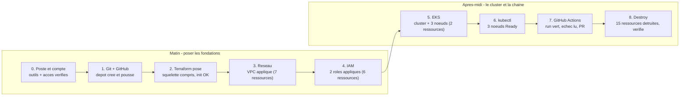
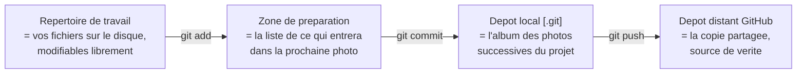
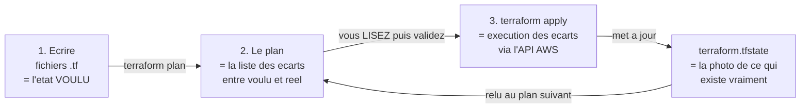
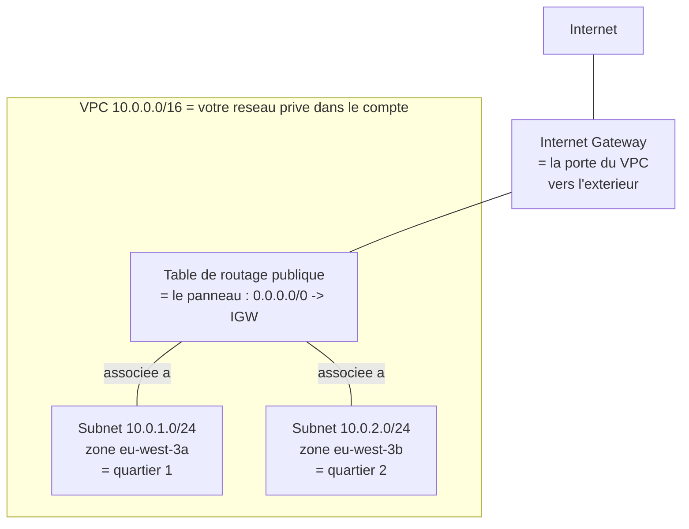
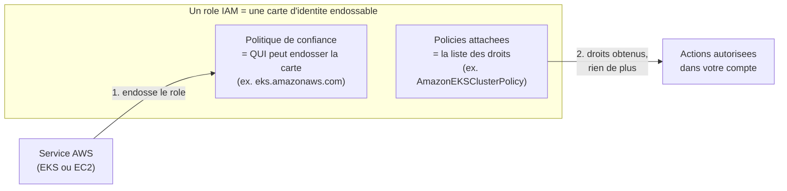
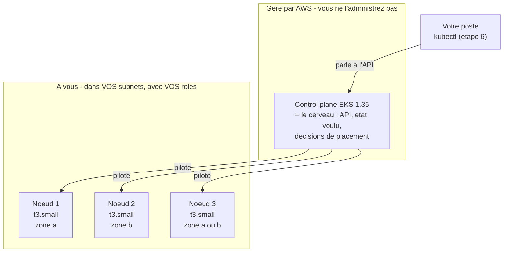
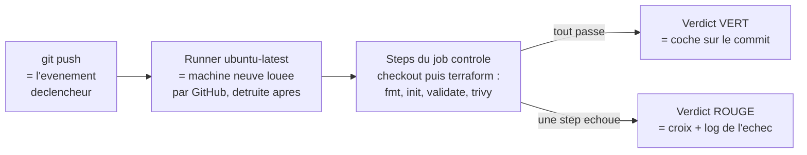

<!-- verif 2026-08-25 : terraform fmt / init / validate / plan testes live sur le squelette et la solution (Terraform 1.12.2, provider aws 6.61.0 telecharge par init, profil AWS reel, plan sans apply) ; compteurs releves : etape 2 validate KO sur network.tf (3 Missing required argument), etape 3 "Plan: 7 to add", etape 4 delta 6 (13 cumules), etape 5 delta 2 (15 cumules), plan complet "Plan: 15 to add, 0 to change, 0 to destroy" ; trivy config 0.74.0 teste live (5 findings HIGH/CRITICAL, .trivyignore verifie exit 0) ; versions d'actions relevees sur api.github.com le 2026-08-26 (checkout v7.0.1 -> @v7, setup-terraform v4.0.1 -> @v4, trivy-action v0.36.0). apply / destroy / commandes post-apply (describe-vpcs, describe-cluster, kubectl, update-kubeconfig, gh repo create) NON rejoues : sorties type, verifiees en statique sur docs.aws.amazon.com, kubernetes.io, cli.github.com, docs.github.com. -->

# TD 1 — AWS + Terraform : l'infrastructure PoC SemiShop, de zéro à détruite

   

🟤 **Le contexte tient en une phrase** : SemiShop veut valider Kubernetes managé sur AWS avant les soldes, et Guive Voss a posé sa condition — *« si ce n'est pas dans Git, ça n'existe pas »*. Aujourd'hui, vous construisez cette infrastructure de bout en bout : un réseau, deux identités, un cluster EKS de 3 nœuds, le tout décrit en Terraform, versionné sur GitHub, contrôlé par un robot à chaque push — et détruit ce soir, preuve à l'appui. Le cahier des charges complet est dans [docs/cahier-des-charges.md](docs/cahier-des-charges.md), la carte de ce que vous allez bâtir dans [docs/architecture.md](docs/architecture.md). Gardez ce second document ouvert : chaque étape du TD en construit un morceau.

Vous n'avez jamais fait de Terraform ni d'AWS ? C'est prévu. Chaque objet est expliqué au moment où vous le rencontrez, chaque commande est suivie de sa sortie attendue, et chaque étape a son tableau de dépannage. Vous avancez seul — l'assistant IA est votre binôme, ce document est votre filet.

## Ce que vous saurez faire ce soir

- Dérouler le cycle Terraform complet — `init`, `fmt`, `validate`, `plan`, `apply`, `destroy` — en **lisant les compteurs** avant d'agir.
- Créer un dépôt GitHub depuis votre terminal, committer, pousser, ouvrir une pull request et lire un run de CI (vert comme rouge).
- Faire produire du code d'infrastructure par un assistant IA **sous contraintes**, puis le relire avec une checklist avant de l'appliquer.
- Expliquer avec vos mots : VPC, subnet, Internet Gateway, table de routage, rôle IAM, control plane EKS, node group, state Terraform.
- Brancher `kubectl` sur un cluster EKS et vérifier qu'il répond.
- Détruire une infrastructure cloud **et prouver** qu'il ne reste rien.

## La journée en un coup d'œil

| Étape | Ce que vous construisez | Durée |
|-------|-------------------------|-------|
| [0. Poste et compte](#étape-0--poste-et-compte-30-min) | outils vérifiés, accès AWS et GitHub opérationnels | 30 min |
| [1. Git et GitHub](#étape-1--git-et-github-vraiment-expliqués-45-min) | le dépôt du projet, créé et poussé | 45 min |
| [2. Terraform posé](#étape-2--terraform-posé-30-min) | le squelette compris (par vous ET par l'IA), `init` passé | 30 min |
| [3. Le réseau](#étape-3--le-réseau-60-min) | VPC, 2 subnets, IGW, routage — appliqués | 60 min |
| [4. IAM](#étape-4--iam-les-identités-du-cluster-45-min) | les 2 rôles du cluster — appliqués | 45 min |
| [5. EKS](#étape-5--eks-le-cluster-75-min) | control plane + 3 nœuds (quiz pendant l'attente) | 75 min |
| [6. Brancher kubectl](#étape-6--brancher-kubectl-30-min) | 3 nœuds `Ready`, premier déploiement témoin | 30 min |
| [7. GitHub Actions](#étape-7--github-actions-vraiment-expliqué-60-min) | run vert, échec volontaire, pull request | 60 min |
| [8. Détruire et rendre](#étape-8--détruire-et-rendre-45-min) | `destroy` vérifié + journal + écarts vers la prod | 45 min |

Total : 7 h — dont une trentaine de minutes d'attentes AWS (création du cluster, destruction) mises à profit par le quiz de mi-journée et le journal de bord : c'est la marge de la journée. Si vous prenez du retard, le déploiement témoin de l'étape 6 et la pull request de l'étape 7 sont compressibles ; les étapes 0 à 5 et 8 ne le sont pas.



## Comment utiliser ce TD

**Lisez, tapez, vérifiez — dans cet ordre.** Chaque étape explique d'abord le concept (le « pourquoi »), puis vous fait agir, puis vous fait contrôler. Après chaque action, un bloc « 🟢 Vérifiez tout de suite » donne la commande de contrôle et sa sortie attendue : ne passez jamais à la suite sur un doute. Si quelque chose coince, le tableau « Erreurs fréquentes » de l'étape couvre les pannes classiques, avec la correction.

**L'IA est votre binôme, pas votre pilote.** Aux étapes 2 à 5 et 7, vous travaillez avec un assistant (ChatGPT, Codex ou équivalent). Le cycle est toujours le même : coller le **prompt fourni** dans [prompts/](prompts/), relire la réponse avec la checklist de [rules/ia-bonnes-pratiques.md](rules/ia-bonnes-pratiques.md), corriger vous-même, puis appliquer vous-même. Les règles non négociables de la journée — préfixe, tags, versions, zéro secret — sont dans [rules/regles-du-td.md](rules/regles-du-td.md) ; si votre assistant sait lire les fichiers du dépôt (Codex par exemple), [AGENTS.md](AGENTS.md) lui donne ce cadre automatiquement.

**Tout ce qui vous arrive s'écrit.** Une erreur comprise, une décision prise, une commande qui sauve : une ligne dans [docs/journal-de-bord.md](docs/journal-de-bord.md). Ce journal est la moitié de votre rendu final.

🔷 Terminal recommandé sous Windows : **Git Bash** (installé avec Git). Toutes les commandes du TD sont écrites pour lui.

---

## Étape 0 — Poste et compte (30 min)

**Objectif** : vérifier que les cinq outils répondent et que vos accès AWS et GitHub fonctionnent — pour ne plus jamais y revenir de la journée.

> 🔷 **Les bases — le compte AWS partagé en 2 minutes** : tous les participants travaillent dans le **même compte AWS** (`039497794217`). Vous y avez un **utilisateur IAM nominatif** (du type `paris07`) : c'est votre identité de connexion, avec ses clés d'accès distribuées par le formateur. À ne pas confondre avec votre **prénom**, que vous poserez dans une variable Terraform : lui sert de **marque** sur tout ce que vous créez (`adrien-vpc`, `adrien-eks`...) et de tag `owner` pour le suivi des coûts. Deux personnes qui créent chacune « un VPC » sans préfixe se marchent dessus ; avec le préfixe, chacun retrouve les siennes et le formateur sait qui a oublié de détruire quoi. Les trois règles complètes du compte partagé sont dans le [README des TDs](../README.md).

### À vous : les cinq outils

Ouvrez Git Bash et passez les cinq commandes, une par une :

```bash
aws --version        # le couteau suisse AWS en ligne de commande
terraform version    # l'outil d'infrastructure as code du jour
kubectl version --client   # le client Kubernetes (servira a l'etape 6)
git --version        # le gestionnaire de versions
gh --version         # le client GitHub en ligne de commande
```

> 🟢 **Vérifiez tout de suite** — sorties du poste de référence (vos numéros peuvent différer légèrement, seuls les minima comptent) :
>
> ```text
> aws-cli/2.26.5 Python/3.13.2 Windows/10 exe/AMD64
> Terraform v1.12.2
> on windows_amd64
> Client Version: v1.36.3
> git version 2.45.1.windows.1
> gh version 2.96.0 (2026-07-02)
> ```
>
> Les minima du TD : `aws` v2, `terraform` >= 1.12, `kubectl` présent, `git` 2.x, `gh` 2.x. Si une commande répond `command not found` : l'outil n'est pas installé ou pas dans le PATH — réinstallez-le puis **rouvrez** le terminal (le PATH se lit à l'ouverture).

### À vous : l'accès AWS

Enregistrez les clés de votre utilisateur IAM (le formateur vous les a remises) :

```bash
aws configure   # pose les cles + la region dans ~/.aws/
```

L'outil pose quatre questions ; répondez ainsi :

```text
AWS Access Key ID [None]:     <votre cle, commence par AKIA>
AWS Secret Access Key [None]: <votre cle secrete>
Default region name [None]:   eu-west-3
Default output format [None]: json
```

`eu-west-3`, c'est Paris — la région imposée par le cahier des charges (N6). Ces clés vivent dans `~/.aws/credentials`, **jamais** dans un fichier du projet ni dans un prompt : c'est la règle n° 5 du TD.

> 🟢 **Vérifiez tout de suite** :
>
> ```bash
> aws sts get-caller-identity   # demande a AWS : qui suis-je ?
> ```
>
> ```json
> {
>     "UserId": "AIDAQSMSAQKU...",
>     "Account": "039497794217",
>     "Arn": "arn:aws:iam::039497794217:user/paris07"
> }
> ```
>
> Trois choses à lire : `Account` = le compte partagé de la formation, `Arn` se termine par **votre** utilisateur. Si vous voyez un autre compte : vos clés pointent ailleurs (un ancien profil ?) — relancez `aws configure`. Si `InvalidClientTokenId` : une clé a été tronquée au collage — recopiez-la en entier.

### À vous : l'accès GitHub

```bash
gh auth login   # relie le terminal a votre compte GitHub
```

Répondez : `GitHub.com`, protocole `HTTPS`, authentification `Login with a web browser`. L'outil affiche un code à 8 caractères, ouvre le navigateur : collez le code, validez. La procédure de référence est sur `cli.github.com`.

> 🟢 **Vérifiez tout de suite** :
>
> ```bash
> gh auth status
> ```
>
> Vous devez voir : `Logged in to github.com account <votre-login>` avec une coche. Si `You are not logged into any GitHub hosts` : le code a expiré avant validation — relancez `gh auth login`.

**Erreurs fréquentes à cette étape** :

| 🟨 Symptôme | Cause probable | Comment le détecter | Correction |
|-------------|----------------|---------------------|------------|
| `command not found` sur un outil | Pas installé, ou PATH non rechargé | La commande échoue dans tout nouveau terminal aussi | Installer, puis rouvrir le terminal |
| `InvalidClientTokenId` sur `sts` | Clé tronquée ou révoquée | Le message cite le token | `aws configure`, recoller les deux clés en entier |
| `sts` répond un autre compte | Variable `AWS_PROFILE` ou vieux profil actif | `echo $AWS_PROFILE` non vide | `unset AWS_PROFILE` puis re-vérifier |
| `gh auth login` boucle | Code expiré, ou navigateur bloqué | Le navigateur n'affiche pas la page de code | Relancer, coller le code dans les 15 min |

---

## Étape 1 — Git et GitHub, vraiment expliqués (45 min)


**Objectif** : créer le dépôt du projet, comprendre ce que fait chaque commande Git (pas seulement la taper), et pousser un premier commit sur GitHub.

**Contexte** : la condition de Guive Voss — « si ce n'est pas dans Git, ça n'existe pas » — n'est pas une lubie. Sans dépôt, votre infrastructure n'est reconstructible que par vous, de mémoire. Avec, n'importe quel membre de l'équipe la rejoue à l'identique (exigence F4), et chaque changement laisse une trace datée et signée.

> 🔷 **Les bases — Git en 2 minutes** : Git photographie votre projet. Vous modifiez des fichiers dans le **répertoire de travail** ; `git add` inscrit les modifications sur la **liste de la prochaine photo** (la « zone de préparation », *staging*) ; `git commit` prend la photo et la range dans l'album local (le dossier caché `.git/`) ; `git push` envoie l'album vers le **dépôt distant** (GitHub), la copie que les autres voient. Quatre lieux, trois commandes :



Une photo (un **commit**) n'est jamais modifiée : on en ajoute de nouvelles. C'est ce qui rend l'historique fiable — et c'est aussi pourquoi un secret commité par erreur reste dans l'album même si on supprime le fichier ensuite.

### Le .gitignore d'abord : ce qui ne part JAMAIS sur GitHub

Avant le premier commit, ouvrez [terraform/.gitignore](terraform/.gitignore). Ce fichier liste ce que Git doit **refuser de photographier**. Chaque ligne a une raison d'être :

| Motif | Ce qu'il écarte | Pourquoi on ne le versionne jamais |
|-------|-----------------|-------------------------------------|
| `.terraform/` | le répertoire de travail créé par `terraform init` (providers téléchargés) | des centaines de Mo, retéléchargeables à l'identique — versionner un téléchargement n'a pas de sens |
| `*.tfstate`, `*.tfstate.*` | **l'état** : la photo de votre infra réelle, et ses sauvegardes | il contient tout ce que Terraform sait de vos ressources, **valeurs sensibles en clair incluses** (en entreprise : mots de passe de bases, clés). Sur GitHub, même privé, c'est une fuite qui attend son heure |
| `crash.log`, `crash.*.log` | journaux laissés par un crash de Terraform | diagnostics propres à votre poste |
| `*.tfvars`, `*.tfvars.json` | vos valeurs de variables (votre prénom aujourd'hui) | chacun a les siennes ; en entreprise, ces fichiers portent souvent des secrets |
| `!*.tfvars.example` | ré-inclut le fichier d'**exemple** (le `!` inverse la règle) | le modèle, lui, se partage : il ne contient aucune valeur réelle |
| `*.tfplan` | un plan enregistré (`terraform plan -out=...`) | il embarque les valeurs sensibles du state, en clair |
| `override.tf*` | fichiers de surcharge locale | propres à un poste, par définition |

Deux absents volontaires, et c'est important : les fichiers `.tf` (le code — c'est justement ce qu'on versionne) et `.terraform.lock.hcl`, que `terraform init` créera à l'étape 2. Ce fichier de verrouillage fige les versions exactes des providers : il **se versionne**, pour que toute l'équipe utilise les mêmes — la documentation Terraform (`developer.hashicorp.com/terraform`) le recommande explicitement.

🟥 À retenir avant tout le reste : **le `terraform.tfstate` ne se versionne jamais**. Ni pour le secret qu'il contient, ni pour le conflit qu'il provoque — deux personnes qui poussent chacune leur state écrasent la vision de l'autre, et Terraform ne sait plus ce qui existe. Le partage d'état en équipe passe par un backend distant (S3 + verrou) — c'est un des « écarts vers la production » que vous documenterez ce soir.

### À vous : créer le dépôt local

Placez-vous à la racine du TD (le dossier qui contient ce README) et enchaînez :

```bash
cd td1-aws-terraform          # adaptez si votre copie porte un autre nom
git init -b main              # cree l'album local, branche initiale nommee main
git status                    # que voit Git ? (fichiers "untracked" : jamais photographies)
```

Le `-b main` compte : sans lui, les Git plus anciens nomment la branche `master`, et le contrôle automatique de l'étape 7 — qui surveille `main` — ne se déclencherait jamais.

Si c'est votre tout premier commit sur ce poste, donnez une identité à Git (elle signe chaque photo) :

```bash
git config --global user.name "Adrien Vossough"        # votre nom
git config --global user.email "adrien.vossough@semishop.example"  # votre email
```

Puis la première photo :

```bash
git add .                                  # tout ce que .gitignore n'ecarte pas
git commit -m "chantier initial du TD1"    # la photo, avec son message
```

> 🟢 **Vérifiez tout de suite** :
>
> ```bash
> git log --oneline    # l'album, une ligne par photo
> git status
> ```
>
> Vous devez voir : une ligne `<7 caractères> chantier initial du TD1`, puis `nothing to commit, working tree clean`. Si `Author identity unknown` : les deux `git config` ci-dessus n'ont pas été passés. Si des messages `LF will be replaced by CRLF` s'affichent : simple avertissement de fins de ligne Windows, sans conséquence ici — continuez.

### À vous : créer le dépôt GitHub et pousser

```bash
gh repo create td1-aws-terraform --private --source=. --push
```

Mot à mot : `gh repo create` crée le dépôt **sur GitHub** ; `--private` le rend visible de vous seul ; `--source=.` le relie au dépôt local du dossier courant (il pose le lien `origin`) ; `--push` pousse la branche `main` dans la foulée. Trois gestes en un.

> 🟢 **Vérifiez tout de suite** :
>
> ```bash
> git remote -v         # le lien local -> distant existe-t-il ?
> gh repo view --web    # ouvre la page du depot dans le navigateur
> ```
>
> Vous devez voir : deux lignes `origin https://github.com/<login>/td1-aws-terraform.git` (fetch et push), puis, dans le navigateur, votre dépôt avec `terraform/`, `docs/`, `rules/`, `prompts/` et ce README. Si la page est vide : le `--push` a échoué — tapez `git push -u origin main` et relisez l'erreur.

⚫ Sur la page du dépôt, l'onglet **Actions** montre déjà un point rouge. Un contrôleur automatique, fourni dans le squelette, s'est déclenché à votre premier push — et il a raison de râler : vos fichiers Terraform sont à trous. Laissez-le tranquille jusqu'à l'étape 7, qui lui est entièrement consacrée ; il passera au vert quand le projet sera complet.

**Erreurs fréquentes à cette étape** :

| 🟨 Symptôme | Cause probable | Comment le détecter | Correction |
|-------------|----------------|---------------------|------------|
| `Author identity unknown` au commit | Pas de nom/email configurés | Le message le dit explicitement | Les deux `git config --global` ci-dessus |
| `remote origin already exists` | Un lien `origin` traîne d'un essai précédent | `git remote -v` montre une autre URL | `git remote remove origin` puis relancer `gh repo create` |
| `graphql: Name already exists on this account` | Le dépôt GitHub existe déjà (essai précédent) | La page GitHub du dépôt existe | Choisir un autre nom, ou supprimer l'ancien dépôt sur GitHub (Settings, tout en bas) |
| `Permission denied` / `authentication failed` au push | `gh auth login` non fait ou expiré | `gh auth status` en erreur | Refaire l'étape 0, partie GitHub |
| Avertissements `LF will be replaced by CRLF` | Fins de ligne Windows | Messages au `git add` | Rien : avertissement inoffensif ici |

---

## Étape 2 — Terraform posé (30 min)


**Objectif** : comprendre ce qu'est Terraform, lire le squelette fourni — en faisant travailler l'IA **dans le bon sens** — et initialiser le projet.

**Contexte** : jusqu'ici, créer un VPC voulait dire cliquer dans la console AWS. Le problème du clic : il ne laisse pas de trace, il ne se rejoue pas, il ne se relit pas. Terraform inverse la logique — vous **décrivez** l'état voulu dans des fichiers texte, l'outil compare avec ce qui existe et fait le nécessaire. Le fichier devient le contrat ; la console, une simple vitrine.

> 🔷 **Les bases — Terraform en 2 minutes** : trois idées suffisent pour la journée.
>
> 1. **HCL, un langage déclaratif** : les fichiers `.tf` décrivent des ressources (« un VPC avec telle plage d'adresses »), pas des actions. L'ordre d'écriture ne compte pas ; Terraform déduit lui-même qui dépend de qui.
> 2. **Le provider** : le greffon qui traduit vos blocs en appels d'API — ici le provider AWS, téléchargé par `terraform init`.
> 3. **Le state** (`terraform.tfstate`) : la **photo de ce qui existe vraiment**. À chaque `plan`, Terraform compare trois choses — vos fichiers (le voulu), le state (le connu), l'API AWS (le réel) — et liste les écarts. `apply` exécute les écarts, puis met la photo à jour.
>
> Le cycle, que vous allez jouer trois fois aujourd'hui (réseau, IAM, EKS) :



La règle n° 6 du TD vit dans ce schéma : le plan s'affiche **pour être lu**. Sa dernière ligne — `Plan: N to add, N to change, N to destroy` — est votre tableau de bord ; un compteur inattendu est un signal d'arrêt, pas un détail.

### À vous : le premier prompt — faire expliquer, pas générer

Le réflexe naturel avec un assistant IA : « écris-moi le code ». Vous allez prendre le réflexe inverse — le squelette existe déjà, faites-le **expliquer**. Un assistant est meilleur professeur particulier que générateur aveugle, et vous devez comprendre ces trois fichiers : tout le reste de la journée s'appuie dessus.

> - Ouvrez [prompts/etape2-comprendre-le-squelette.md](prompts/etape2-comprendre-le-squelette.md).
> - Collez le prompt dans votre assistant, puis collez à la suite le contenu de [terraform/versions.tf](terraform/versions.tf), [terraform/providers.tf](terraform/providers.tf) et [terraform/variables.tf](terraform/variables.tf).
> - Lisez la réponse **avec les fichiers ouverts à côté**. Le fichier `prompts/` liste les trois points que la réponse doit contenir ; s'il en manque un, demandez-le explicitement.
> - Notez dans votre journal la phrase qui vous a le plus appris.

Ce que ces trois fichiers posent, en une ligne chacun : `versions.tf` épingle l'outil (`>= 1.12.0`) et le provider AWS (`~> 6.61`) — règle n° 4, on ne prend pas « la version que propose l'assistant » ; `providers.tf` fixe la région `eu-west-3` et pose vos **4 tags sur toute ressource** via `default_tags` (impossible de les oublier) ; `variables.tf` déclare `prenom`, avec une validation qui refuse majuscules et accents avant même de toucher AWS.

### À vous : votre prénom, puis l'initialisation

```bash
cd terraform                                    # tous les .tf vivent ici
cp terraform.tfvars.example terraform.tfvars    # votre copie personnelle (ignoree par Git)
```

Ouvrez `terraform.tfvars` et remplacez `adrien` par **votre** prénom, en minuscules, sans accent. Puis :

```bash
terraform init    # telecharge le provider AWS, prepare le dossier
```

> 🟢 **Vérifiez tout de suite** — la sortie attendue :
>
> ```text
> Initializing the backend...
> Initializing provider plugins...
> - Finding hashicorp/aws versions matching "~> 6.61"...
> - Installing hashicorp/aws v6.61.0...
> - Installed hashicorp/aws v6.61.0 (signed by HashiCorp)
> Terraform has created a lock file .terraform.lock.hcl to record the provider
> selections it made above. Include this file in your version control repository
> so that Terraform can guarantee to make the same selections by default when
> you run "terraform init" in the future.
>
> Terraform has been successfully initialized!
> ```
>
> Deux créations à constater (`ls -a`) : le dossier `.terraform/` (le provider — que `.gitignore` écarte) et `.terraform.lock.hcl` (le verrou de versions — que vous **committerez**, comme la sortie vous le dit elle-même). Si le téléchargement échoue : réseau ou proxy — relancez une fois, puis vérifiez votre connexion.

### À vous : premier contact avec fmt et validate

```bash
terraform fmt        # remet les fichiers au format canonique (ne dit rien si tout est propre)
terraform validate   # coherence de la configuration - sans toucher au cloud
```

`validate` va **échouer**. C'est prévu, et c'est votre premier exercice de lecture d'erreur Terraform :

```text
Error: Missing required argument

  on network.tf line 17, in resource "aws_subnet" "public_a":
  17: resource "aws_subnet" "public_a" {

The argument "vpc_id" is required, but no definition was found.
```

Lisez la structure du message, elle sera la même toute la journée : **quel problème** (un argument requis manque), **où** (fichier, ligne, ressource), **quoi exactement** (`vpc_id`). Ici, trois erreurs de ce type sur `network.tf` : les blocs du squelette sont volontairement vides — c'est le travail de l'étape 3. Un `validate` rouge n'est pas une panne : c'est une liste de choses à écrire.

> 🟢 **Vérifiez tout de suite** : `terraform validate` liste exactement 3 erreurs `Missing required argument`, toutes sur `network.tf` (lignes des blocs `public_a`, `public_b`, `public`). Si vous voyez d'autres erreurs — un accent dans `terraform.tfvars`, une quote perdue — corrigez-les d'abord : à l'étape 3, ces trois-là doivent être les seules restantes.

**Erreurs fréquentes à cette étape** :

| 🟨 Symptôme | Cause probable | Comment le détecter | Correction |
|-------------|----------------|---------------------|------------|
| `init` échoue en téléchargement | Réseau, proxy d'entreprise | Message `could not connect to registry.terraform.io` | Relancer ; configurer le proxy (`HTTPS_PROXY`) si le poste en a un |
| `Invalid value for variable` dès `validate` | Prénom avec majuscule ou accent dans `terraform.tfvars` | Le message cite la règle de validation | Prénom en minuscules ASCII (`adrien`, pas `Adrien`) |
| `validate` râle sur un fichier que vous n'avez pas touché | Collage accidentel dans un `.tf` | `git status` montre le fichier modifié | `git diff` pour voir, `git checkout -- <fichier>` pour restaurer |
| `terraform: command not found` dans `terraform/` | PATH, ou binaire non installé | Échoue aussi à la racine | Refaire la vérification d'outils de l'étape 0 |

---

## Étape 3 — Le réseau (60 min)


**Objectif** : construire le socle réseau — un VPC, deux subnets publics, une porte vers Internet, un panneau de routage — et le **voir exister** dans la console AWS.

**Contexte** : avant de poser un cluster, il lui faut un terrain. Chez AWS, le terrain s'appelle un VPC, et EKS exigera qu'il s'étende sur deux zones. Quatre concepts à installer avant de taper quoi que ce soit — prenez ces cinq minutes de lecture, elles économisent une heure de débogage :

- Un **VPC** (Virtual Private Cloud) est votre réseau privé dans le compte AWS : une plage d'adresses IP rien qu'à vous — ici `10.0.0.0/16`, soit toutes les adresses de `10.0.0.0` à `10.0.255.255`. Par défaut, rien n'y entre, rien n'en sort.
- Un **subnet** est un quartier de ce réseau, découpé dans la plage et **ancré dans une zone de disponibilité** (un groupe de datacenters : `eu-west-3a`, `eu-west-3b`...). Nos deux quartiers : `10.0.1.0/24` en zone `a`, `10.0.2.0/24` en zone `b` — deux zones, parce qu'EKS l'exige et qu'un datacenter peut tomber.
- L'**Internet Gateway** (IGW) est la porte du VPC vers Internet. Sans elle, le réseau est clos.
- La **table de routage** est le panneau indicateur : elle dit au trafic où aller. La route locale (rester dans `10.0.0.0/16`) est implicite ; vous ajoutez « tout le reste (`0.0.0.0/0`) sort par la porte » — et vous **associez** ce panneau aux deux quartiers, sinon ils suivent le panneau par défaut, qui ignore la porte.



Nos subnets sont **publics** : les machines qui y naissent reçoivent une adresse IP publique (`map_public_ip_on_launch = true`). C'est le compromis assumé du PoC — l'alternative propre (subnets privés derrière une NAT Gateway) coûte ~0,05 $ de l'heure plus le trafic, hors budget pour une journée. [docs/architecture.md](docs/architecture.md) documente ce choix, et il ouvrira votre liste d'« écarts vers la production » ce soir. Les définitions normatives de ces objets sont dans la documentation VPC d'AWS (`docs.aws.amazon.com/vpc`).

### À vous : générer network.tf avec l'IA, sous contraintes

Le squelette [terraform/network.tf](terraform/network.tf) pose les blocs, vides, avec des TODO numérotés. Vous allez les faire remplir — pas les remplir à l'aveugle :

> - Ouvrez [prompts/etape3-network.md](prompts/etape3-network.md), collez le prompt dans votre assistant, puis collez à la suite votre `network.tf` actuel.
> - **Relisez la réponse avant tout collage**, checklist de [rules/ia-bonnes-pratiques.md](rules/ia-bonnes-pratiques.md) en main : région jamais codée en dur (le provider la porte), `var.prenom` dans chaque tag `Name`, aucun tag `app`/`env`/`owner`/`team` répété (les `default_tags` s'en chargent), **rien en trop** — pas de NAT, pas d'Elastic IP, pas de security group. Les assistants adorent enrichir ; le cahier des charges, non.
> - Vérifiez la forme de la route : un bloc `route { ... }` **dans** `aws_route_table`, comme le prompt l'exige. (Une ressource `aws_route` séparée est valable en soi, mais votre plan annoncerait 8 ressources au lieu de 7 — le TD suit la variante à 7.)
> - Collez le code validé dans `network.tf`, en conservant les noms de blocs du squelette (`aws_vpc.main`, `aws_subnet.public_a`...) : `eks.tf` les référencera à l'étape 5.
> - Ce que vous ne comprenez pas ne rentre pas dans le projet : demandez à l'assistant d'expliquer la ligne, **avant** de la garder.

```bash
terraform fmt        # l'IA indente rarement comme terraform
terraform validate   # les 3 erreurs de l'etape 2 doivent avoir disparu
```

> 🟢 **Vérifiez tout de suite** : `Success! The configuration is valid.` — votre premier `validate` vert de la journée. Sinon, le message vous donne fichier + ligne : argument mal orthographié ou référence cassée, corrigez et relancez.

### À vous : plan, lecture, apply

```bash
terraform plan   # la liste des ecarts : que ferait AWS si j'applique ?
```

Le plan détaille chaque ressource à créer (`+` devant chaque attribut), puis conclut :

```text
Plan: 7 to add, 0 to change, 0 to destroy.
```

Lisez-le vraiment, c'est un contrat : **7 à créer** — le VPC, 2 subnets, l'IGW, la table de routage, 2 associations — **0 à modifier, 0 à détruire**. Un `to destroy` non nul à ce stade signifierait que vous vous apprêtez à casser quelque chose : on n'applique jamais un plan qu'on n'a pas compris. Cherchez aussi vos tags dans le détail : chaque ressource porte `app`, `env`, `owner`, `team` (les `default_tags` au travail) plus son `Name` préfixé.

```bash
terraform apply   # execute le plan ; tapez yes a la confirmation
```

Terraform réaffiche le plan, attend votre `yes`, puis crée — une trentaine de secondes :

```text
Apply complete! Resources: 7 added, 0 changed, 0 destroyed.
```

<!-- verif 2026-08-25 : apply non rejoue (pas d'ecriture AWS depuis le poste auteur) ; sortie type et sortie describe-vpcs ci-dessous verifiees en statique sur docs.aws.amazon.com/cli (format json aws ec2 describe-vpcs) -->

> 🟢 **Vérifiez tout de suite** — par l'API, puis par les yeux :
>
> ```bash
> aws ec2 describe-vpcs --filters "Name=tag:Name,Values=<prenom>-vpc" \
>   --query "Vpcs[].{id:VpcId,cidr:CidrBlock,name:Tags[?Key=='Name']|[0].Value}"
> ```
>
> Sortie type (vos identifiants différeront) :
>
> ```json
> [
>     {
>         "id": "vpc-0a1b2c3d4e5f67890",
>         "cidr": "10.0.0.0/16",
>         "name": "adrien-vpc"
>     }
> ]
> ```
>
> Puis dans la **console AWS** (le formateur a affiché l'URL de connexion) : vérifiez en haut à droite que la région affichée est **Paris (eu-west-3)** — c'est le piège n° 1 de la console —, tapez `VPC` dans la barre de recherche, menu **Vos VPC** : votre `<prenom>-vpc` est dans la liste, au milieu de ceux des autres participants. Ouvrez-le, onglet **Tags** : vos 4 tags + `Name`. Menu **Sous-réseaux** : vos deux quartiers, chacun dans sa zone. Ce que vous avez décrit en texte existe en vrai — et vous savez le retrouver.

**Erreurs fréquentes à cette étape** :

| 🟨 Symptôme | Cause probable | Comment le détecter | Correction |
|-------------|----------------|---------------------|------------|
| `UnauthorizedOperation` / `AccessDenied` à l'apply | Clés d'un autre compte ou profil parasite | `aws sts get-caller-identity` ne montre pas votre utilisateur du TD | Refaire l'étape 0 (accès AWS), `unset AWS_PROFILE` |
| `VpcLimitExceeded` | Quota de VPC de la région atteint (compte partagé) | Le message le nomme | Vérifiez d'abord qu'un VPC à VOTRE prénom ne traîne pas d'un essai précédent (`describe-vpcs` ci-dessus, puis `terraform destroy` dans le dossier fautif) ; sinon signalez-le — quota mutualisé, inutile de retenter en boucle |
| Le plan annonce 8 ressources, pas 7 | L'IA a produit une ressource `aws_route` séparée | Lire le plan : `aws_route.xxx` listé | Valable mais hors variante du TD : repliez la route en bloc `route {}` dans la table, ou assumez 8 en le notant au journal |
| Le plan veut créer un security group ou une NAT | L'IA a enrichi hors cahier des charges | Ressources non demandées dans le plan | Supprimer ces blocs — la checklist « rien en trop » a été sautée |
| Console : « aucun VPC » | Mauvaise région affichée | Le sélecteur en haut à droite ne dit pas Paris | Basculer sur `eu-west-3` |
| La CLI répond « introuvable » sur une ressource pourtant créée | Région CLI différente de celle du TD | `aws configure get region` ne répond pas `eu-west-3` | `aws configure set region eu-west-3` |

🔹 Committez ce jalon (sans pousser — le push viendra à l'étape 7) : `git add network.tf && git commit -m "reseau du PoC : vpc, subnets, igw, routage"`. Une étape franchie = une photo.

---

## Étape 4 — IAM, les identités du cluster (45 min)

**Objectif** : créer les deux rôles IAM dont EKS a besoin — et comprendre pourquoi un service a besoin d'une « carte d'identité ».

**Contexte** : dans quelques minutes, le service EKS va créer des machines, brancher des cartes réseau, écrire des règles de pare-feu — **dans votre compte**. Au nom de quoi ? Chez AWS, personne n'agit sans identité : ni les humains, ni les services. C'est le rôle d'IAM (Identity and Access Management), et c'est le sujet où l'à-peu-près coûte le plus cher en production.

> 🔷 **Les bases — IAM en 2 minutes** : trois objets et un verbe.
>
> - Une **identité**, c'est qui agit : un utilisateur (vous, `paris07`) ou un **rôle**.
> - Une **policy**, c'est une liste de droits : un document qui dit « autorisé à faire ceci sur cela ». AWS en fournit des toutes prêtes, dites *managées* — vous n'écrirez aucun droit à la main aujourd'hui.
> - Un **rôle**, c'est une carte d'identité **sans propriétaire fixe** : quelqu'un l'**endosse** (*assume*), et pendant ce temps il agit avec les droits attachés à la carte. Qui a le droit de l'endosser ? C'est écrit **sur la carte** : la politique de confiance (*assume role policy*).
>
> Le verbe qui relie tout : *assumer un rôle*. Le service EKS se présente, la politique de confiance dit « eks.amazonaws.com peut endosser », il endosse, il obtient les droits des policies attachées — et rien d'autre.



Pourquoi **deux** rôles et pas un ? Parce que deux acteurs différents vont agir, avec des besoins différents. Le **control plane** (endossé par `eks.amazonaws.com`) doit piloter le cluster : une policy, `AmazonEKSClusterPolicy`. Les **nœuds** sont des machines EC2 (endossé par `ec2.amazonaws.com`) : ils doivent rejoindre le cluster (`AmazonEKSWorkerNodePolicy`), tirer des images de conteneurs (`AmazonEC2ContainerRegistryReadOnly` — lecture seule, notez-le) et gérer les adresses IP des pods (`AmazonEKS_CNI_Policy`). Donner les droits du pilote aux machines, ou l'inverse, violerait le principe du moindre privilège : chacun sa carte, chacun sa liste — c'est le modèle documenté sur `docs.aws.amazon.com/eks` (pages *cluster IAM role* et *node IAM role*).

### À vous : générer iam.tf, et guetter LE piège

Le squelette [terraform/iam.tf](terraform/iam.tf) décrit les six ressources attendues en commentaires. Faites-les produire :

> - Ouvrez [prompts/etape4-iam.md](prompts/etape4-iam.md), collez le prompt puis votre `iam.tf` actuel.
> - À la relecture, un contrôle prime sur tous les autres : **les ARN des 4 policies, caractère par caractère**, contre ceux du prompt. Sur ce terrain, les assistants ont deux vices connus : **inventer** un nom de policy plausible (`AmazonEKSNodePolicy` n'existe pas), ou **sur-doter** — glisser `AdministratorAccess` « pour que ça marche ». Un ARN inventé n'échoue qu'à l'apply ; un `AdministratorAccess` ne fait échouer rien du tout, et c'est bien le problème : tout fonctionne, avec une carte d'identité qui ouvre toutes les portes du compte. Le scanner de l'étape 7 ou une revue humaine le rattrape — au mieux.
> - Vérifiez les deux principals : `eks.amazonaws.com` sur le rôle cluster, `ec2.amazonaws.com` sur le rôle des nœuds. Identiques = réponse fausse.
> - Collez, en gardant les noms (`aws_iam_role.cluster`, `aws_iam_role.nodes`, et les attachements `cluster_eks`, `nodes_worker`, `nodes_ecr`, `nodes_cni`).

```bash
terraform fmt && terraform validate   # toujours avant le plan
terraform plan
```

> 🟢 **Vérifiez tout de suite** : le plan conclut `Plan: 6 to add, 0 to change, 0 to destroy.` — 2 rôles + 4 attachements, et **rien sur le réseau** (vos 7 ressources de l'étape 3 sont dans le state : aucun écart, Terraform n'y touche pas). Si le plan veut « recréer » du réseau : vous avez changé un nom de bloc dans `network.tf` — restaurez-le.

```bash
terraform apply   # relire, puis yes - quelques secondes suffisent
```

<!-- verif 2026-08-25 : apply et get-role non rejoues ; forme de sortie verifiee en statique sur docs.aws.amazon.com/cli (aws iam get-role, list-attached-role-policies) -->

> 🟢 **Vérifiez tout de suite** :
>
> ```bash
> aws iam get-role --role-name <prenom>-eks-cluster-role --query Role.Arn
> aws iam list-attached-role-policies --role-name <prenom>-eks-node-role \
>   --query "AttachedPolicies[].PolicyName"
> ```
>
> Sortie type :
>
> ```text
> "arn:aws:iam::039497794217:role/adrien-eks-cluster-role"
> [
>     "AmazonEKSWorkerNodePolicy",
>     "AmazonEC2ContainerRegistryReadOnly",
>     "AmazonEKS_CNI_Policy"
> ]
> ```
>
> Exactement trois policies sur le rôle des nœuds — ni deux, ni quatre. Si `NoSuchEntity` : le rôle ne s'est pas créé sous ce nom — comparez avec `terraform state list | grep iam`.

**Erreurs fréquentes à cette étape** :

| 🟨 Symptôme | Cause probable | Comment le détecter | Correction |
|-------------|----------------|---------------------|------------|
| `NoSuchEntity` sur un `policy_arn` à l'apply | Policy **inventée** par l'IA | L'ARN fautif est dans le message d'erreur | Remplacer par l'ARN exact du prompt, `apply` de nouveau |
| `EntityAlreadyExists` sur un rôle | Un rôle à ce nom traîne (essai précédent, ou prénom en double dans le groupe) | `aws iam get-role --role-name <nom>` répond | Si c'est le vôtre : le détruire depuis l'ancien dossier (`terraform destroy`) ; si c'est un homonyme : suffixez votre `prenom` (`adrien2`) dans `terraform.tfvars` |
| `MalformedPolicyDocument` | JSON de la politique de confiance abîmé au collage | Le message pointe le document | Reprendre le bloc `jsonencode` complet depuis la réponse de l'assistant |
| `AdministratorAccess` dans le plan | Sur-dotation par l'IA | Relecture du plan (`policy_arn`) | Supprimer l'attachement — et noter l'anecdote au journal, elle vaut de l'or |
| Le plan annonce plus de 6 ressources | Policies inline ou ressources bonus | Lire le plan | Revenir aux 6 ressources du TODO, rien d'autre |

🔹 Jalon : `git add iam.tf && git commit -m "roles iam du cluster et des noeuds"`.

---

## Étape 5 — EKS, le cluster (75 min)

**Objectif** : créer le control plane EKS et ses 3 nœuds — puis mettre à profit les ~15 minutes de création pour le quiz de mi-journée.

**Contexte** : tout converge ici. Le réseau de l'étape 3 va héberger, les rôles de l'étape 4 vont autoriser, et les 7 microservices SemiShop (catalogue, commandes, cart, inventory...) auront demain un endroit où tourner. Il reste à comprendre ce qu'on achète exactement quand on dit « Kubernetes managé ».

> 🔷 **Les bases — EKS en 2 minutes** : un cluster Kubernetes a deux moitiés.
>
> - Le **control plane** — le cerveau : l'API qui reçoit vos ordres, la base qui mémorise l'état voulu, les boucles qui décident « il manque un conteneur ici, je le relance ». Avec EKS, **AWS opère cette moitié** : serveurs, haute disponibilité, sauvegardes, correctifs — vous ne les verrez jamais. C'est ce que facture le forfait de 0,10 $ de l'heure.
> - Le **node group** — les bras : vos machines EC2 (3 × `t3.small`, 2 vCPU / 2 Go chacune), qui exécutent les conteneurs que le cerveau leur confie. Cette moitié est **chez vous** : dans vos subnets, avec votre rôle IAM, à votre charge.
>
> La version Kubernetes se choisit et s'épingle — `1.36`, la plus récente en support standard chez EKS (`docs.aws.amazon.com/eks`, page *Kubernetes versions*). Règle n° 4 du TD : c'est le cahier des charges qui fixe la version, pas la mémoire de l'assistant.



Un détail du squelette mérite vos yeux : les `depends_on`. Terraform sait déduire l'ordre quand une ressource en référence une autre (`role_arn = aws_iam_role.cluster.arn` suffit à créer le rôle d'abord). Mais rien ne relie *naturellement* le cluster aux **attachements de policies** — et un rôle créé sans ses droits fait échouer la création, ou pire, la laisse passer amputée. Le `depends_on` force ce qui ne se déduit pas : « attends que la carte porte ses droits avant de la présenter ».

### À vous : générer eks.tf, planifier, lancer — puis patienter utile

> - Ouvrez [prompts/etape5-eks.md](prompts/etape5-eks.md), collez le prompt puis votre `eks.tf` actuel.
> - À la relecture : version `"1.36"` épinglée (pas « la dernière » de l'assistant), `["t3.small"]`, `scaling_config` 3/3/3, les **deux** subnets, les `depends_on` sur les **attachements** (pas sur les rôles) — et le contrôle « rien en trop » : ni module `terraform-aws-modules/eks` (on apprend les ressources brutes aujourd'hui), ni addons, ni `launch_template`.
> - Complétez aussi [terraform/outputs.tf](terraform/outputs.tf) (TODO 5.3 et 5.4) : deux `output` qui afficheront, après l'apply, le nom du cluster et la commande exacte de l'étape 6. La solution tient en quatre lignes — demandez-les à l'assistant si besoin, en collant le fichier.

```bash
terraform fmt && terraform validate
terraform plan
```

> 🟢 **Vérifiez tout de suite** : `Plan: 2 to add, 0 to change, 0 to destroy.` — le cluster et le node group, rien d'autre. Vos 13 ressources déjà appliquées ne bougent pas. Sous le compteur, `Changes to Outputs` annonce vos deux outputs : normal, ils naîtront avec le cluster.

```bash
terraform apply   # yes - puis c'est LONG, et c'est normal
```

🔵 **Annonce de l'attente** : comptez **8 à 15 minutes** — AWS monte le control plane (6 à 10 min), puis les 3 machines démarrent et rejoignent le cluster (~2-5 min). Run de référence : 6 min 11 s + 1 min 47 s. Le terminal égrène `aws_eks_cluster.main: Still creating... [2m30s elapsed]` : tant que le compteur avance, tout va bien. Ne coupez pas le terminal ; un `apply` interrompu laisse un état à moitié construit, rattrapable mais pénible.

### Pendant l'attente — quiz de mi-journée

Cinq questions sur la matinée, réponses sous chaque question (cliquez pour déplier — après avoir répondu).

**Q1.** `git add` puis `git commit` : que contient la « photo » si vous modifiez un fichier **entre** les deux commandes ?

<details>
<summary>Voir la réponse</summary>

🟢 La version du fichier **au moment du `git add`**. La zone de préparation fige ce qui entrera dans le commit ; une modification postérieure attendra le prochain `add`. C'est le sens du schéma de l'étape 1 : trois lieux distincts, et `add` est un passage de frontière.
</details>

**Q2.** Pourquoi `terraform.tfstate` ne se versionne-t-il jamais sur GitHub ? (deux raisons)

<details>
<summary>Voir la réponse</summary>

🟢 (1) Il contient des **valeurs sensibles en clair** — chez SemiShop en production, ce seraient des mots de passe de bases. (2) Deux personnes qui poussent chacune leur state s'**écrasent mutuellement** : Terraform perd la trace du réel. En équipe, l'état vit dans un backend distant verrouillé (S3) — écart vers la production n° 3 de votre rendu.
</details>

**Q3.** Votre `terraform plan` de l'étape 4 aurait affiché `6 to add, 0 to change, 2 to destroy`. Vous appliquez ?

<details>
<summary>Voir la réponse</summary>

🟥 Non. Un `to destroy` inattendu signifie que le code décrit un monde **sans** deux ressources existantes — renommage de bloc, fichier écrasé... On lit le détail du plan, on trouve les deux victimes, on corrige le code, et on ne tape `yes` que devant un plan compris. Règle n° 6 du TD.
</details>

**Q4.** Quelle différence entre la politique de **confiance** d'un rôle IAM et ses **policies attachées** ?

<details>
<summary>Voir la réponse</summary>

🟢 La politique de confiance dit **qui peut endosser** la carte (`eks.amazonaws.com` pour le rôle cluster) ; les policies attachées disent **ce que le porteur peut faire** (`AmazonEKSClusterPolicy`). L'une est la serrure de la carte, les autres sont la liste de droits qu'elle ouvre.
</details>

**Q5.** À quoi servent les `default_tags` de `providers.tf`, et pourquoi le tag `owner` en particulier ?

<details>
<summary>Voir la réponse</summary>

🟢 Ils posent `app`, `env`, `owner`, `team` sur **toute** ressource taggable sans les répéter bloc par bloc — l'oubli devient impossible. `owner = var.prenom` permet au formateur de suivre les coûts **par personne** sur le compte partagé, et de savoir qui appeler quand une ressource survit à la journée.
</details>

### Le cluster est là — constatez

L'apply se termine sur :

```text
Apply complete! Resources: 2 added, 0 changed, 0 destroyed.

Outputs:

cluster_name = "adrien-eks"
update_kubeconfig_command = "aws eks update-kubeconfig --name adrien-eks --region eu-west-3"
```

<!-- verif 2026-08-25 : apply et describe-cluster/nodegroup non rejoues ; statuts et chemins query verifies en statique sur docs.aws.amazon.com/eks (cluster status ACTIVE, nodegroup status ACTIVE) ; la forme des outputs provient du plan reel (Changes to Outputs releve au plan live) -->

> 🟢 **Vérifiez tout de suite** :
>
> ```bash
> aws eks describe-cluster --name <prenom>-eks --query cluster.status
> aws eks describe-nodegroup --cluster-name <prenom>-eks \
>   --nodegroup-name <prenom>-nodes --query nodegroup.status
> ```
>
> Les deux doivent répondre `"ACTIVE"`. `CREATING` ? L'API a fini après Terraform sur le node group — attendez une minute et relancez. Tout autre statut (`DEGRADED`, `CREATE_FAILED`) : voyez le tableau ci-dessous.

**Erreurs fréquentes à cette étape** :

| 🟨 Symptôme | Cause probable | Comment le détecter | Correction |
|-------------|----------------|---------------------|------------|
| `InvalidParameterException: unsupported Kubernetes version` | Version mal saisie (`1.36.0`, `1.37`...) | Le message cite la version envoyée | `version = "1.36"`, exactement |
| `AccessDeniedException` à la création du cluster | `role_arn` pointe le mauvais rôle (celui des nœuds ?) | Relire `eks.tf` : `role_arn` doit citer `aws_iam_role.cluster.arn` | Corriger la référence, `apply` |
| `NodeCreationFailure: Instances failed to join` | Les nœuds ne joignent pas le control plane — souvent un réseau bancal (`map_public_ip_on_launch` absent, association de table de routage manquante) | `aws eks describe-nodegroup ... --query nodegroup.health` détaille | Vérifier étape 3 (les 7 ressources, dont les 2 associations), corriger, `terraform apply` |
| Erreur de quota à la création des nœuds (limite d'instances / vCPU du compte) | Quota EC2 de la région atteint (compte partagé : chaque participant lance 6 vCPU) | Le message d'erreur ou la santé du node group (`describe-nodegroup ... --query nodegroup.health`) cite la limite | Vérifiez qu'un ancien node group à votre nom ne tourne pas ; sinon signalez — quota mutualisé, retenter n'arrange rien |
| `Ec2SubnetInvalidConfiguration` | Subnets sans IP publique automatique | Le message cite les subnets | `map_public_ip_on_launch = true` sur les deux, `apply` |
| Apply interrompu (terminal fermé, réseau) | — | `terraform plan` montre un monde à moitié créé | Relancer `terraform apply` : Terraform reprend où il en était — c'est l'intérêt du state |

🔹 Jalon : `git add eks.tf outputs.tf && git commit -m "cluster eks 1.36 et node group 3x t3.small"`.

---

## Étape 6 — Brancher kubectl (30 min)

**Objectif** : parler au cluster depuis votre poste, vérifier ses 3 nœuds, et lui faire exécuter un premier conteneur témoin.

**Contexte** : le cluster existe côté AWS, mais votre `kubectl` ne le connaît pas encore. `kubectl` lit ses accès dans un fichier local, le **kubeconfig** (`~/.kube/config`) : qui est l'API, comment s'authentifier. Une commande AWS l'y inscrit — c'est exactement celle que votre output `update_kubeconfig_command` a préparée.

```bash
terraform output -raw update_kubeconfig_command   # relire la commande preparee
aws eks update-kubeconfig --name <prenom>-eks --region eu-west-3
```

<!-- verif 2026-08-26 : run a blanc live complet (prefixe claude) — apply 15/15 (cluster 6m11s, node group 1m47s), update-kubeconfig OK, 3 noeuds Ready v1.36.2-eks-b3f9404, destroy complet ; sorties ci-dessous relevees sur ce run (prefixe adapte) -->

Sortie constatée :

```text
Added new context arn:aws:eks:eu-west-3:039497794217:cluster/adrien-eks to C:\Users\adrien\.kube\config
```

Pourquoi ça marche sans mot de passe : l'utilisateur IAM qui **crée** un cluster EKS en devient automatiquement administrateur — vos clés AWS de l'étape 0 servent de sésame (`docs.aws.amazon.com/eks`, page *update-kubeconfig*).

> 🟢 **Vérifiez tout de suite** :
>
> ```bash
> kubectl get nodes   # la question la plus simple : qui travaille pour moi ?
> ```
>
> Sortie constatée — 3 nœuds, tous `Ready` (les noms et âges varient) :
>
> ```text
> NAME                                       STATUS   ROLES    AGE   VERSION
> ip-10-0-1-98.eu-west-3.compute.internal    Ready    <none>   75s   v1.36.2-eks-b3f9404
> ip-10-0-2-217.eu-west-3.compute.internal   Ready    <none>   74s   v1.36.2-eks-b3f9404
> ip-10-0-2-90.eu-west-3.compute.internal    Ready    <none>   73s   v1.36.2-eks-b3f9404
> ```
>
> Lisez les noms : `ip-10-0-1-...` et `ip-10-0-2-...` — vos machines vivent bien dans **vos** deux subnets. Si `Unauthorized` : vos clés actuelles ne sont pas celles qui ont créé le cluster (`aws sts get-caller-identity` pour trancher). Si `NotReady` : les nœuds finissent de démarrer — trente secondes et relancez.

Regardez aussi ce que le cluster fait tourner **sans vous** :

```bash
kubectl get pods -A   # -A : tous les namespaces, y compris le systeme
```

Trois familles de pods système, toutes dans `kube-system` : **coredns** (× 2) — l'annuaire DNS interne, pour que les services se trouvent par nom ; **kube-proxy** (× 3, un par nœud) — l'aiguilleur réseau de chaque machine ; **aws-node** (× 3) — le plugin réseau d'AWS, qui donne aux pods de vraies adresses IP du VPC. Personne ne les a déployés : le control plane les installe d'office.

### Facultatif si l'horaire tient : un conteneur témoin

Preuve par l'exécution — demandez au cluster de faire tourner quelque chose :

```bash
kubectl create deployment hello --image=public.ecr.aws/nginx/nginx:stable
kubectl get pods            # relancez jusqu'a STATUS Running (quelques secondes)
kubectl delete deployment hello   # on ne laisse rien trainer
```

L'image vient de la **galerie publique ECR** d'AWS, pas de Docker Hub : Docker Hub limite les téléchargements anonymes par adresse IP, et une salle entière qui tire la même image au même moment déclenche ce plafond — le pod resterait en `ErrImagePull`. La galerie ECR (`public.ecr.aws`) sert les images nginx officielles sans ce plafond depuis le réseau AWS.

> 🟢 **Vérifiez tout de suite** : `kubectl get pods` montre `hello-...` en `Running` avant le delete, puis `No resources found` après. Le cluster obéit : c'est tout ce qu'on voulait savoir — le déploiement sérieux des microservices SemiShop, c'est le TD 2.

**Erreurs fréquentes à cette étape** :

| 🟨 Symptôme | Cause probable | Comment le détecter | Correction |
|-------------|----------------|---------------------|------------|
| `error: You must be logged in to the server (Unauthorized)` | kubectl parle au bon cluster mais avec la mauvaise identité AWS | `aws sts get-caller-identity` ≠ utilisateur créateur | Revenir aux clés de l'étape 0, relancer `update-kubeconfig` |
| `no such host` / timeout sur l'API | Contexte kubeconfig périmé (vieux cluster) | `kubectl config current-context` cite un autre cluster | Relancer `update-kubeconfig`, ou `kubectl config use-context <arn-du-votre>` |
| Pod témoin en `ErrImagePull` | Faute de frappe dans l'image, ou plafond Docker Hub si vous avez utilisé `nginx` court | `kubectl describe pod <nom>` montre l'erreur de pull | Utiliser l'image `public.ecr.aws/nginx/nginx:stable` exacte |
| `NotReady` persistant (> 3 min) | Réseau des nœuds (retour étape 5) | `kubectl describe node <nom>`, conditions | Dérouler la ligne `NodeCreationFailure` de l'étape 5 |

---

## Étape 7 — GitHub Actions, vraiment expliqué (60 min)


**Objectif** : comprendre le contrôleur automatique qui veille sur votre dépôt depuis l'étape 1, le passer au vert, le faire échouer volontairement, puis travailler comme une équipe : par pull request.

**Contexte** : ce matin, vous avez relu le code de l'IA avec une checklist. Vous avez été rigoureux — le serez-vous encore au vingtième commit, un vendredi à 18h ? L'exigence N3 du cahier des charges répond à cette question humaine : les contrôles répétitifs se confient à un robot, qui les rejoue **à chaque push**, sans fatigue et sans complaisance.

> 🔷 **Les bases — GitHub Actions en 2 minutes** : quatre mots et un fichier.
>
> - Un **workflow** : un fichier YAML dans `.github/workflows/` qui décrit quoi faire et quand. Le vôtre : [.github/workflows/terraform-ci.yml](.github/workflows/terraform-ci.yml).
> - Un **déclencheur** (`on:`) : l'événement qui lance le workflow — ici chaque `push` sur `main` et chaque `pull request`.
> - Un **job** : un lot d'étapes exécuté sur un **runner** — une machine que GitHub loue, neuve à chaque run, détruite après.
> - Une **step** : une action du job. La première qui échoue arrête le job et le passe au rouge.
>
> Le vocabulaire de référence est sur `docs.github.com/actions`.



### Lecture guidée du workflow, bloc par bloc

Ouvrez [.github/workflows/terraform-ci.yml](.github/workflows/terraform-ci.yml) — chaque ligne y est commentée ; voici le fil :

1. **`on:`** — `push` sur `main` et `pull_request` : le robot voit passer tout ce qui compte.
2. **`permissions: contents: read`** — le workflow peut lire le dépôt, rien d'autre. Le moindre privilège vaut aussi pour les robots.
3. **`runs-on: ubuntu-latest`** et **`working-directory: terraform`** — une machine Linux jetable, et toutes les commandes jouées dans le dossier des `.tf`.
4. **`actions/checkout@v7`** — récupère votre code sur le runner (sans quoi la machine est vide). Une *action* est une brique réutilisable publiée sur une place de marché ; le `@v7` épingle sa version majeure — même réflexe que pour le provider AWS.
5. **`hashicorp/setup-terraform@v4`** avec `terraform_version: "1.12.2"` — installe **le même** Terraform que votre poste : même outil, même verdict.
6. **`terraform fmt -check -recursive`** — le gate de format : `-check` ne corrige rien, il **échoue** si un fichier n'est pas canonique, et le nomme.
7. **`terraform init -backend=false` puis `terraform validate`** — le gate de cohérence : le `-backend=false` télécharge le provider (pour que `validate` connaisse le schéma des ressources) sans créer d'état — la CI ne gère aucune infra.
8. **`aquasecurity/trivy-action@v0.36.0`** — le gate de sécurité : Trivy relit vos `.tf` en y cherchant les défauts de configuration connus (réseau exposé, chiffrement absent...), et `exit-code: "1"` transforme toute détection HIGH/CRITICAL en run rouge. Sans ce paramètre, Trivy serait un rapport ; avec, c'est un gardien.

Et le fichier [.trivyignore](.trivyignore), à la racine ? Trivy, appliqué à notre PoC, détecte précisément nos **compromis assumés** : subnets publics à IP automatique, endpoint d'API accessible en public, secrets non chiffrés par clé dédiée. Il a raison — et nous aussi : ces écarts sont des décisions documentées de [docs/architecture.md](docs/architecture.md), pas des oublis. Le `.trivyignore` liste ces règles **avec leur justification en commentaire** : c'est la manière professionnelle de passer un scanner — on ne le débranche jamais en silence, on trace chaque exception. Supprimez mentalement ce fichier : le run serait rouge, à juste titre.

🟥 **Pourquoi AUCUNE clé AWS dans cette CI** — la question à toujours se poser devant un pipeline. Ce workflow lit du texte : `fmt`, `validate` et Trivy n'appellent jamais l'API AWS. Lui confier des clés serait leur créer un lieu de fuite de plus (un log verbeux, une action compromise) sans aucun bénéfice. L'`apply`, lui, reste sur votre poste aujourd'hui — le jour où une CI doit toucher au cloud, elle reçoit une identité temporaire dédiée (fédération OIDC), pas des clés copiées-collées ; vous croiserez ce modèle plus tard dans la formation.

### À vous : le run vert

```bash
terraform -chdir=terraform fmt -check -recursive   # le verdict local d'abord (depuis la racine)
git add . && git status                            # relire ce qui part
git commit -m "projet complet : reseau, iam, eks, outputs"
git push
```

Puis allez **lire** : page GitHub du dépôt, onglet **Actions**. Un run porte le nom de votre message de commit ; cliquez-le, puis cliquez le job **controle**. Chaque step s'affiche avec sa durée ; dépliez `valider la configuration` : le `Success! The configuration is valid.` que vous connaissez — même outil, autre machine. Tout est vert : première fois depuis l'étape 1.

> 🟢 **Vérifiez tout de suite** :
>
> ```bash
> gh run list --limit 2   # les derniers runs, sans quitter le terminal
> ```
>
> Sortie type :
>
> ```text
> STATUS  TITLE                                    WORKFLOW      BRANCH  EVENT  ...
> ✓       projet complet : reseau, iam, eks, ...   terraform-ci  main    push
> X       chantier initial du TD1                  terraform-ci  main    push
> ```
>
> Votre historique raconte la journée : rouge au premier push (fichiers à trous), vert maintenant. Si le nouveau run est absent : votre branche ne s'appelle pas `main` — `git branch -m main && git push -u origin main`.

### À vous : casser, lire, réparer — le cycle complet

Un contrôle qu'on n'a jamais vu mordre est un contrôle qu'on ne comprend pas. Sabotez le format :

> - Ouvrez `terraform/network.tf`, ajoutez huit espaces devant une ligne `cidr_block` (l'alignement HCL est cassé, la syntaxe reste valide).
> - `git add . && git commit -m "test: format volontairement casse" && git push`
> - Onglet Actions : le run vire au rouge en ~30 secondes. Cliquez-le, cliquez le job, dépliez la step rouge `verifier le format` : `terraform fmt -check` **nomme le fichier fautif** (`network.tf`) et sort en erreur. Les steps suivantes n'ont pas tourné : premier échec, arrêt.
> - Le réflexe d'équipe : reproduire **en local** avant de corriger — `terraform -chdir=terraform fmt -check -recursive` vous affiche le même verdict que le runner. (Un log de CI vous restera un jour obscur : le prompt [prompts/etape7-expliquer-un-echec-ci.md](prompts/etape7-expliquer-un-echec-ci.md) fait expliquer l'échec par l'IA — la cause d'abord, la correction ensuite.)
> - Réparez : `terraform -chdir=terraform fmt` (sans `-check` : il corrige), puis `git add . && git commit -m "fix: format retabli" && git push`. Run vert.

Rouge lu, cause comprise, correction locale, vert retrouvé : vous venez de jouer le cycle que vivent les équipes dix fois par jour — au journal.

### À vous : la pull request, comme en équipe

Pousser sur `main` directement, c'est travailler seul. L'exigence N2 demande une **branche par changement et une revue avant fusion** — le véhicule s'appelle une pull request (PR) : « voilà ma branche, voilà le diff, les contrôles sont-ils verts, quelqu'un valide ? ».

```bash
git switch -c tag-costcenter          # creer une branche et s'y placer
```

Ajoutez un cinquième tag dans le bloc `default_tags` de `terraform/providers.tf` — la finance de SemiShop veut suivre le PoC :

```hcl
      costcenter = "poc-td1" # suivi budget PoC (demande finance)
```

```bash
git add terraform/providers.tf
git commit -m "tag costcenter sur toutes les ressources"
git push -u origin tag-costcenter     # -u : publie la branche
gh pr create --fill                   # ouvre la PR (--fill reprend le message de commit)
```

`gh pr create` affiche l'URL de la PR : ouvrez-la. En bas de page, l'encadré **Checks** : `terraform-ci` tourne **sur la PR**, avant toute fusion — le robot relit votre proposition, pas votre fait accompli. Check vert : bouton **Merge pull request**, confirmez, puis supprimez la branche quand GitHub le propose. Et resynchronisez votre poste :

```bash
git switch main && git pull           # rapatrier la fusion
```

> 🟢 **Vérifiez tout de suite** : `gh pr list` répond `no open pull requests` ; `git log --oneline -3` montre le commit de fusion en tête. 🔷 Votre code déclare maintenant un tag que l'infra réelle n'a pas encore : un `terraform plan` listerait des ressources `to change` (mise à jour de tags, sans destruction). Inutile de l'appliquer — l'infra vit ses dernières minutes.

**Erreurs fréquentes à cette étape** :

| 🟨 Symptôme | Cause probable | Comment le détecter | Correction |
|-------------|----------------|---------------------|------------|
| Aucun run ne se déclenche | Branche ≠ `main`, ou workflow déplacé | `git branch` ; le fichier doit être à `.github/workflows/` **à la racine du dépôt** | `git branch -m main && git push -u origin main` ; remettre le fichier au bon chemin |
| Step `verifier le format` rouge | Fichier non formaté poussé | Le log nomme le fichier | `terraform fmt` en local, commit, push |
| Step `valider la configuration` rouge | Argument manquant / référence cassée poussée | Le log donne fichier + ligne (le même message qu'en local) | Reproduire en local (`terraform validate`), corriger, pousser |
| Step trivy rouge | Ressource ajoutée hors cahier des charges (nouvelle règle détectée) | Le log cite l'ID de règle (`AVD-AWS-...`) et le fichier | Corriger la ressource ; si l'écart est une décision assumée : l'ajouter au `.trivyignore` **avec justification** — jamais en silence |
| `gh pr create` répond qu'il n'y a rien à comparer | Commit fait sur `main` au lieu de la branche | `git log main..tag-costcenter` vide | `git switch -c tag-costcenter` **avant** de committer ; sinon déplacer le commit (`git reset --soft HEAD~1` sur main, recommitter sur la branche) |
| La PR affiche des checks « pending » sans fin | File d'attente des runners publics | La page Actions montre le run en attente | Patienter 1-2 min ; relancer via « Re-run jobs » si bloqué |

---

## Étape 8 — Détruire et rendre (45 min)

**Objectif** : détruire l'infrastructure **entièrement**, le prouver, et livrer le rendu de la journée : votre journal et vos écarts vers la production.

**Contexte** : la règle n° 8 est la plus chère de toutes — au sens propre. Un cluster oublié coûte ~0,17 $ de l'heure : la nuit, le week-end, jusqu'à ce que quelqu'un s'en aperçoive. La destruction n'est pas la fin triste du TD, c'est sa démonstration finale : une infrastructure **as code** se détruit aussi proprement qu'elle se crée, parce que Terraform sait tout ce qu'il a créé — c'est son state.

### À vous : destroy, en lisant d'abord

```bash
cd terraform
terraform destroy   # affiche le plan de destruction, PUIS attend votre yes
```

Avant le `yes`, la même discipline qu'à l'aller — lisez la conclusion :

```text
Plan: 0 to add, 0 to change, 15 to destroy.
```

**15 to destroy** : vos 7 ressources réseau + 6 IAM + 2 EKS. Ni 14 (il en resterait une), ni 16 (d'où sortirait-elle ?). Le compte est bon : tapez `yes`. La destruction prend **10 à 15 minutes** — le node group d'abord (le plus long : AWS draine et éteint les 3 machines), le cluster, puis le réseau. Profitez-en pour ouvrir le journal de bord et commencer la section « écarts vers la production » ci-dessous.

```text
Destroy complete! Resources: 15 destroyed.
```

<!-- verif 2026-08-25 : destroy non rejoue (aucun apply prealable) ; compteur 15 deduit du plan live "15 to add" sur la meme configuration ; sorties de verification post-destruction verifiees en statique sur docs.aws.amazon.com/cli -->

> 🟢 **Vérifiez tout de suite** — la confiance c'est bien, la preuve c'est mieux :
>
> ```bash
> aws ec2 describe-vpcs --filters "Name=tag:owner,Values=<prenom>" --query "Vpcs"
> aws eks list-clusters --query "clusters[?contains(@, '<prenom>')]"
> aws iam list-roles --query "Roles[?contains(RoleName, '<prenom>')].RoleName"
> ```
>
> Trois réponses attendues, trois fois la même : `[]`. Le filtre par tag `owner` et par préfixe ne montre que **vos** ressources — celles des autres participants continuent d'exister, et c'est tout l'intérêt du nommage du matin. Terminez par la console : menu VPC, votre `<prenom>-vpc` a disparu de la liste. Capture d'écran ou sortie de terminal : joignez la preuve au rendu.

**Erreurs fréquentes à cette étape** :

| 🟨 Symptôme | Cause probable | Comment le détecter | Correction |
|-------------|----------------|---------------------|------------|
| `DependencyViolation` sur le VPC ou un subnet en fin de destroy | Une interface réseau (ENI) créée par EKS met du temps à se libérer | Le message cite la dépendance | Attendre 2-3 minutes, relancer `terraform destroy` : il est idempotent et reprend au point bloqué |
| Destroy interrompu (terminal fermé) | — | `terraform plan` liste des survivants | Relancer `terraform destroy` — le state sait où il en était |
| `describe-vpcs` non vide après destroy | Ressource créée **hors** Terraform (un clic console pendant la journée ?) | Elle n'apparaît pas dans `terraform state list` | La supprimer à la console (elle n'a jamais été dans le state — Terraform ne détruit que ce qu'il connaît) |
| Le dossier a été supprimé avant le destroy | Plus de state = Terraform amnésique | — | Ménage manuel à la console, dans l'ordre inverse de création (node group, cluster, rôles, VPC) — long et pénible : c'est LA raison de ne jamais supprimer un dossier Terraform avant son destroy |

### Le rendu de la journée

Deux pièces, dans le dépôt, poussées :

**1. Le journal de bord** ([docs/journal-de-bord.md](docs/journal-de-bord.md)) — vos lignes de la journée : erreurs comprises, décisions, commandes qui ont sauvé. « L'apply EKS a échoué sur un ARN de policy inventé par l'IA, détecté en comparant au prompt » vaut cent fois « étape 4 OK ».

**2. Les écarts vers la production** — la section du journal à remplir maintenant. Ce PoC a fait des compromis **en connaissance de cause** ; les nommer, c'est prouver que vous savez où vous avez simplifié. Pour chacun : l'écart, et ce qu'on ferait en production. Votre liste doit au moins couvrir :

- **Subnets publics, pas de NAT** : chaque nœud porte une IP publique → en prod, nœuds en subnets privés derrière une NAT Gateway.
- **Endpoint d'API public** : l'API du cluster répond depuis Internet (protégée par l'authentification, exposée quand même) → endpoint privé, ou liste de CIDR autorisés.
- **State local** : un seul opérateur possible, un poste perdu = state perdu → backend distant S3 avec verrouillage.
- **Secrets non chiffrés par clé dédiée** : → `encryption_config` avec une clé KMS.
- **Aucun log du control plane** : impossible d'auditer qui a fait quoi dans le cluster → journaux d'audit activés vers CloudWatch.
- **3 nœuds fixes, une seule taille** : pas d'autoscaling, pas de tolérance de charge → groupes multi-taille, autoscaler.
- **Apply depuis un poste, clés longue durée** : → apply en CI avec identité fédérée temporaire (OIDC), revue obligatoire avant.

Relisez ensuite votre [.trivyignore](.trivyignore) : les trois premières lignes de votre liste y figurent déjà, justifiées — le scanner et vous êtes d'accord depuis le début, documents à l'appui.

```bash
cd .. && git add docs/journal-de-bord.md
git commit -m "rendu td1 : journal et ecarts vers la production"
git push
```

### Quiz final — 8 questions

**Q1.** Que contient `terraform.tfstate`, et pourquoi ne va-t-il jamais sur GitHub ?

<details>
<summary>Voir la réponse</summary>

🟢 La photo complète de l'infrastructure réelle telle que Terraform la connaît — identifiants, attributs, **valeurs sensibles en clair**. Il ne se versionne jamais : fuite de secrets, et écrasements mutuels à plusieurs. En équipe : backend distant verrouillé.
</details>

**Q2.** `terraform plan` affiche `0 to add, 9 to change, 0 to destroy` alors que vous n'attendiez rien. Que faites-vous ?

<details>
<summary>Voir la réponse</summary>

🟢 On n'applique pas : on lit le détail pour identifier les 9 changements et leur cause (un tag modifié ? une valeur par défaut qui a bougé ?). Un plan se comprend avant de se valider — et un `change` de tags est bénin, mais on le **sait** après lecture, pas avant.
</details>

**Q3.** À quoi sert l'Internet Gateway, et que se passe-t-il si la table de routage n'est pas **associée** aux subnets ?

<details>
<summary>Voir la réponse</summary>

🟢 L'IGW est la porte du VPC vers Internet. Sans association, les subnets suivent la table par défaut du VPC, qui ignore cette porte : machines injoignables et incapables de sortir — les nœuds EKS ne rejoindraient jamais le cluster (c'est la panne `NodeCreationFailure` de l'étape 5).
</details>

**Q4.** Pourquoi deux rôles IAM, et que dit la « politique de confiance » de chacun ?

<details>
<summary>Voir la réponse</summary>

🟢 Deux acteurs, deux besoins : le control plane (endossé par `eks.amazonaws.com`, une policy de pilotage) et les nœuds EC2 (endossés par `ec2.amazonaws.com`, trois policies : rejoindre, tirer les images, gérer les IP). Un seul rôle cumulant tout violerait le moindre privilège.
</details>

**Q5.** Qu'opère AWS dans EKS, et qu'est-ce qui reste à votre charge ?

<details>
<summary>Voir la réponse</summary>

🟢 AWS opère le control plane : API, base d'état, haute disponibilité, correctifs. Restent à votre charge : les nœuds (vos EC2, vos subnets, votre rôle), la version (épinglée et à faire évoluer), et tout ce qui tourne dessus.
</details>

**Q6.** Pourquoi ce TD ne met-il **aucune clé AWS** dans GitHub Actions ?

<details>
<summary>Voir la réponse</summary>

🟢 La CI ne fait que lire le code (`fmt`, `validate`, scan) : aucun appel AWS. Des clés stockées là seraient un risque de fuite sans bénéfice. Quand une CI doit toucher au cloud, on lui donne une identité temporaire fédérée (OIDC), pas des clés durables.
</details>

**Q7.** Que fait le `.trivyignore`, et qu'est-ce qui distingue son usage d'un scanner « débranché » ?

<details>
<summary>Voir la réponse</summary>

🟢 Il liste des règles précises que le scan n'applique pas — chacune étant un **écart assumé, justifié en commentaire** et documenté dans l'architecture. Débrancher le scanner (le retirer, `exit-code: 0`) ferait taire **tous** les défauts, y compris les futurs. L'exception est tracée, le gardien reste en poste.
</details>

**Q8.** Après `terraform destroy`, quelles vérifications prouvent qu'il ne reste rien à vous ?

<details>
<summary>Voir la réponse</summary>

🟢 `Destroy complete! Resources: 15 destroyed.` d'abord, puis la contre-preuve par l'API : `describe-vpcs` filtré sur le tag `owner`, `list-clusters` et `list-roles` filtrés sur le préfixe — trois `[]` — et un coup d'œil console. Le compteur seul ne suffit pas : une ressource créée hors Terraform lui échappe.
</details>

---

## Récap de la journée

🟢 **Ce que vous savez maintenant faire** :

- Dérouler `init` → `fmt` → `validate` → `plan` → `apply` → `destroy` en lisant chaque compteur (7, 6, 2 à l'aller — 15 au retour).
- Créer un dépôt GitHub au terminal, committer par jalons, pousser, ouvrir et fusionner une pull request.
- Cadrer un assistant IA par un prompt contraint, et attraper ses écarts : ressource en trop, policy inventée, version déclassée.
- Expliquer VPC, subnet, IGW, table de routage, rôle IAM, control plane, node group — avec les mots du schéma d'architecture.
- Lire un run de CI, le faire échouer exprès, reproduire l'échec en local, le réparer.
- Détruire une infra et le prouver par l'API.

🟨 **Pièges à retenir** :

- Un plan se **lit** avant de se valider — le compteur inattendu est un stop.
- Le `tfstate` et les `.tfvars` ne vont jamais sur GitHub ; le `.terraform.lock.hcl`, si.
- L'IA enrichit par défaut : la checklist « rien en trop » attrape la NAT, le security group et l'`AdministratorAccess` non demandés.
- La console AWS ment quand la région est mauvaise : vérifier **Paris (eu-west-3)** avant de conclure « ça n'existe pas ».
- Une ressource créée à la main hors Terraform échappe au `destroy` : tout passe par le code, ou rien.

🔷 **Points clés à retenir** :

- L'infrastructure as code, c'est trois garanties : reproductible (F4), relisible (N2), jetable (règle n° 8) — vous avez exercé les trois le même jour.
- Le state est la mémoire de Terraform : le protéger (backend) et ne jamais le contourner sont les deux faces du même principe.
- Un contrôle automatique n'a de valeur que bloquant, et une exception n'est acceptable que tracée.

🔹 **Prochaine étape** : [TD 2 — Kubernetes/EKS](../td2-k8s-eks/README.md). L'infrastructure d'aujourd'hui se remonte en une commande demain matin (`terraform apply` — c'est toute la beauté de la chose) ; vous y poserez namespaces, RBAC, quotas, supervision Prometheus/Grafana, et les microservices SemiShop eux-mêmes. Les subnets publics d'aujourd'hui, premier écart de votre liste, y deviennent le point de départ du durcissement.
