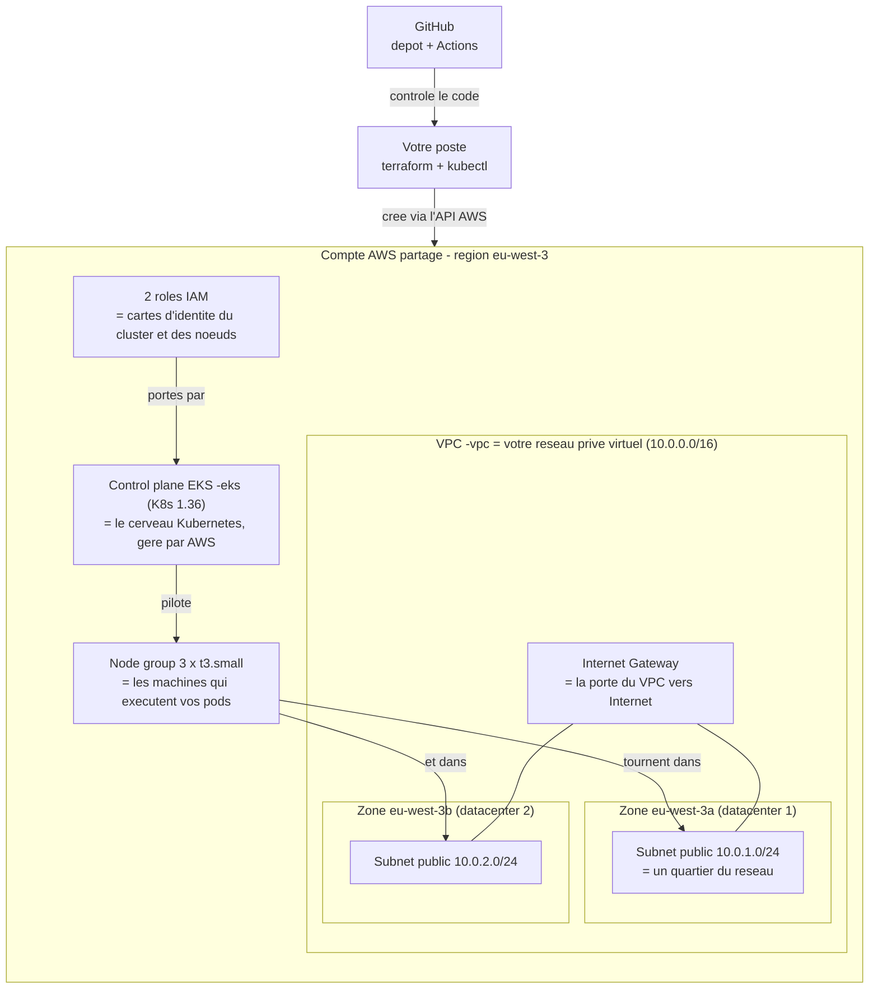
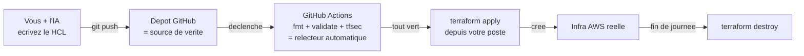

# Architecture technique cible — TD 1

Ce document est votre **carte**. Chaque étape du TD construit une partie de ce schéma ; revenez-y à chaque étape pour situer ce que vous êtes en train de créer.

## Vue d'ensemble

## Décisions d'architecture (et leurs raisons)

| Décision | Choix | Pourquoi | L'alternative production |
|----------|-------|----------|--------------------------|
| Kubernetes | EKS 1.36 (managé) | AWS opère le control plane ; version la plus récente en support standard | idem, avec upgrades planifiés |
| Nœuds | 3 x `t3.small` (2 vCPU / 2 Go) | assez pour SemiShop + la supervision du TD 2, ~0,07 $/h les trois | instances plus grosses, autoscaling |
| Réseau | 2 subnets **publics**, pas de NAT Gateway | une NAT coûte ~0,05 $/h + le trafic ; en PoC d'une journée, on l'assume et on le **documente** | nœuds en subnets privés derrière une NAT |
| Zones | 2 AZ (`eu-west-3a`, `3b`) | EKS exige au moins 2 zones ; on encaisse la panne d'un datacenter | 3 AZ |
| IAM | 2 rôles créés par Terraform | le cluster et les nœuds ont chacun leur « carte d'identité » à moindre privilège | idem + rôles applicatifs (IRSA) |
| État Terraform | fichier local `terraform.tfstate` | un seul opérateur par infra, une journée | backend S3 + verrou (travail d'équipe) |
| Nommage | tout préfixé `<prenom>-` | compte AWS **partagé** entre participants | un compte par environnement |
| Tags | `app`, `env`, `owner`, `team` | retrouver qui possède quoi et suivre les coûts | politique de tags imposée |

🟨 **Le compromis à connaître** : des nœuds en subnet public portent une IP publique — le pare-feu (security group géré par EKS) protège, mais la surface d'exposition est réelle. C'est le premier écart « PoC vers prod » de votre rendu, et la porte d'entrée du TD 2 (sécurisation).

## Ce que Terraform crée, ressource par ressource

| Ressource Terraform | Objet AWS créé | Étape du TD |
|---------------------|----------------|-------------|
| `aws_vpc` | le réseau privé virtuel | 3 |
| `aws_subnet` x2 | deux sous-réseaux publics, un par zone | 3 |
| `aws_internet_gateway` | la porte vers Internet | 3 |
| `aws_route_table` + associations | le panneau de routage « 0.0.0.0/0 -> IGW » | 3 |
| `aws_iam_role` x2 + attachements | les identités du control plane et des nœuds | 4 |
| `aws_eks_cluster` | le control plane Kubernetes | 5 |
| `aws_eks_node_group` | les 3 machines `t3.small` | 5 |

## Chaîne de livraison du code

Versions épinglées (vérifiées le 2026-08-25) : Terraform `>= 1.12` (testé 1.12.2), provider AWS `~> 6.0`, Kubernetes EKS `1.36`.
