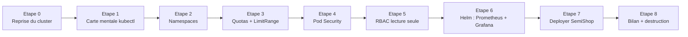
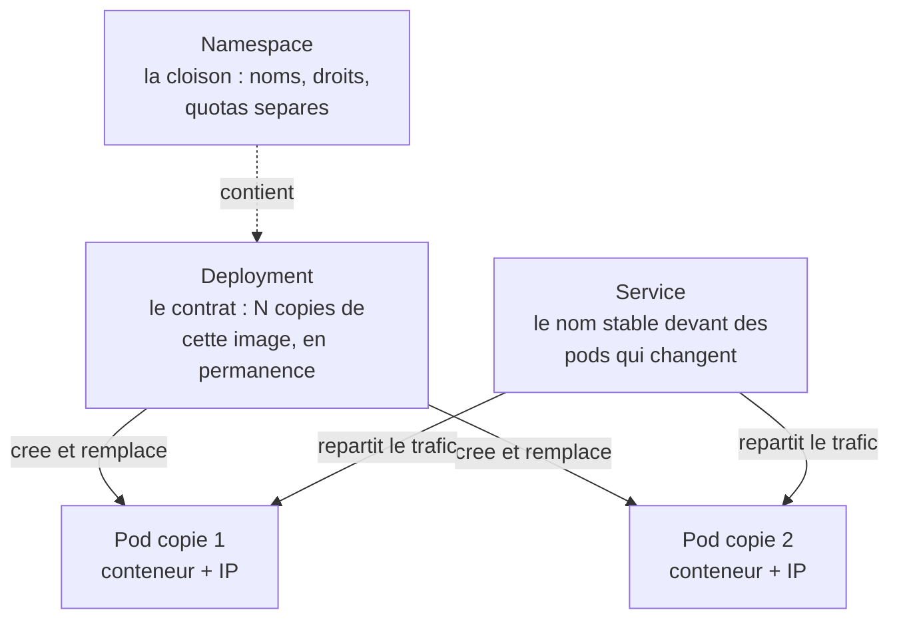
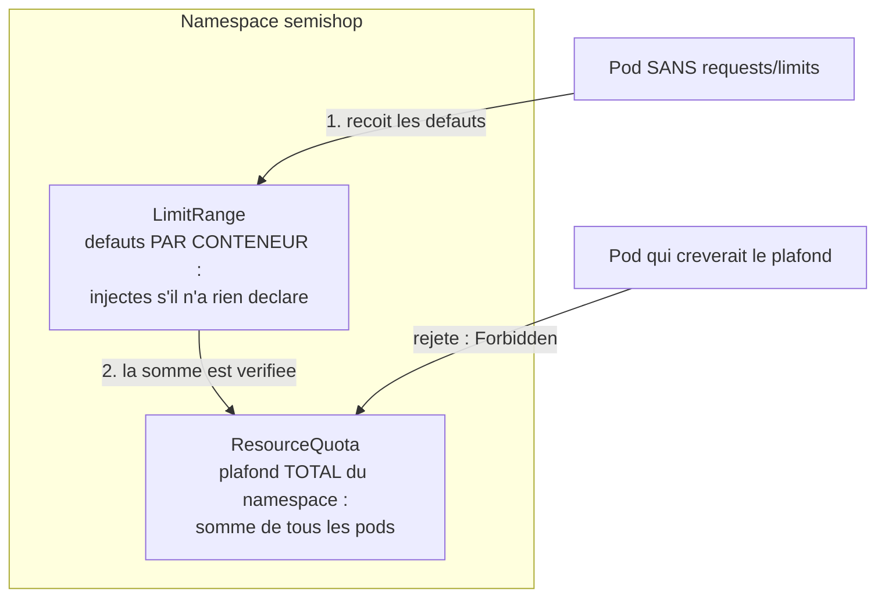
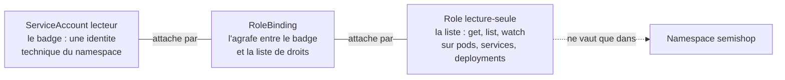
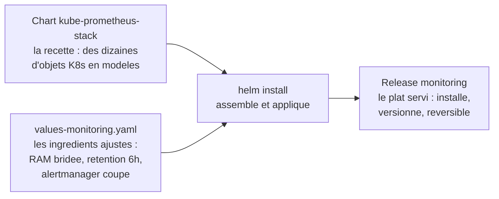

<!-- verif 2026-08-26 : chart kube-prometheus-stack 88.5.4 (app v0.93.1, Prometheus v3.14.0, Grafana 13.2.0) verifie live via helm repo update + search ; helm template avec helm/values-monitoring.yaml rendu sans erreur ; tous les YAML solution passes en kubectl apply --dry-run=server sur kind v1.36.1 (objets namespaces valides contre le namespace default, creation de namespaces interdite sur le cluster de validation). Run a blanc live sur un EKS reel (claude-eks, 2026-08-26) : 3 noeuds Ready v1.36.2-eks ; LimitRange injecte bien 250m/256Mi + 100m/128Mi ; messages reels confirmes au format annonce — "exceeded quota: semishop-quota, requested/used/limited" et "violates PodSecurity baseline:latest: privileged (must not set securityContext.privileged=true)" ; can-i = yes/no/no ; helm install 88.5.4 avec ces values -> 7 pods Running en ~70 s (grafana 3/3, prometheus 2/2) ; secret monitoring-grafana lisible par la commande donnee ; inventory 2/2 (image ECR adrien-1.0.0, un restart initial constate comme documente) + postgres 1/1 avec son Warning restricted ; quota Used = 1500m/2 cpu, 1Gi/2Gi, 3/10 pods. Restent 🟣 (non joues) : visite Grafana/Prometheus en UI (port-forward), build+push de l'image par le participant. Commandes ECR reprises verbatim de ressources/acces-eks-poc.md (testees live 2026-08-25). -->

# TD 2 — Kubernetes/EKS : du cluster nu à la plateforme SemiShop

Le TD 1 s'est terminé sur un cluster EKS qui tourne — et qui ne sert encore à rien : aucune application, aucun droit défini, aucune limite, aucun regard sur ce qui s'y passe. Adrien Vossough l'a dit dans le [cahier des charges](docs/cahier-des-charges.md) : *« un cluster nu n'est pas une plateforme »*. Aujourd'hui vous construisez cette plateforme, pièce par pièce, et vous terminez avec le service `inventory` de SemiShop qui répond, supervisé par Prometheus et Grafana — le tout piloté depuis votre poste, avec votre assistant IA en binôme.

## Ce que vous saurez faire à la fin de la journée

- Lire un cluster Kubernetes avec `kubectl` : objets, namespaces, événements, états de pods.
- Cloisonner un cluster : namespaces, quotas de ressources, valeurs par défaut.
- Durcir l'entrée d'un namespace avec les Pod Security Standards, et lire un rejet d'admission.
- Créer un compte technique en lecture seule avec RBAC, et prouver ses limites.
- Installer une stack de supervision avec Helm, version épinglée et valeurs maîtrisées.
- Déployer une application réelle (API + base de données) depuis un registre ECR partagé, secret compris.
- Détruire proprement, dans le bon ordre.

## Votre journée en un coup d'œil



| Étape | Ce que vous construisez | Durée |
|-------|--------------------------|-------|
| 0 — Reprise | le cluster du TD 1 répond, le bon contexte kubectl | 20 min |
| 1 — Carte mentale | les objets Kubernetes, `kubectl get`/`describe`, lire un manifest | 40 min |
| 2 — Namespaces | les cloisons `semishop` et `monitoring` | 30 min |
| 3 — Quotas + LimitRange | les plafonds de ressources, et deux preuves | 45 min |
| 4 — Pod Security | le règlement à l'entrée de `semishop`, un rejet lu et compris | 40 min |
| 5 — RBAC | le badge lecture seule, trois vérifications | 45 min |
| 6 — Supervision | Prometheus + Grafana par Helm, dashboards ouverts | 75 min |
| 7 — SemiShop | `inventory` + PostgreSQL déployés, vus dans Grafana | 60 min |
| 8 — Bilan | tableau de sécurité, écarts vers la prod, destruction, quiz | 35 min |
| **Total** | | **6 h 30** + 30 min de marge |

La marge n'est pas du confort : une image qui se pousse lentement, un pod qui met deux minutes à démarrer, une erreur à comprendre — c'est le quotidien du métier, le planning l'absorbe.

## Comment travailler aujourd'hui

La méthode est celle des [règles du TD](rules/regles-du-td.md) et du [cycle IA](rules/ia-bonnes-pratiques.md) — relisez ces deux pages maintenant, elles font foi toute la journée. La boucle : à chaque étape vous **cadrez** l'assistant avec le prompt fourni ([prompts/](prompts/)), vous **relisez** sa proposition avec la checklist, vous **corrigez**, puis vous **appliquez vous-même** — `--dry-run=client` d'abord, apply ensuite, vérification immédiate enfin. L'assistant ne lance jamais une commande sur le cluster ; c'est votre rôle, et c'est la règle de la formation : *l'IA propose, vous contrôlez, vous validez*. Si votre outil lit le dépôt (Codex CLI, agent IDE), le fichier [AGENTS.md](AGENTS.md) lui donne déjà le contexte et les règles.

Gardez [docs/journal-de-bord.md](docs/journal-de-bord.md) ouvert dès maintenant : chaque étape franchie et chaque erreur expliquée s'y notent au fil de l'eau. C'est le livrable de la journée, avec le tableau de sécurité de l'étape 8. Et un repère pour toute la journée : les commandes se lancent depuis la **racine du dossier du TD** (`td2-k8s-eks/`) — c'est de là que les chemins `k8s/`, `semishop/` et `helm/` ont un sens.

🟥 Une seule interdiction absolue : aucun mot de passe ni secret ne passe dans un fichier YAML versionné **ni dans un prompt**. Vous verrez à l'étape 7 comment faire autrement.

---

## Étape 0 — Reprendre le cluster du TD 1 (20 min)

**Objectif** : repartir d'un état vérifié — les trois outils répondent, `kubectl` parle bien à **votre** cluster, les 3 nœuds sont `Ready`.

Le TD 1 s'est terminé par `terraform destroy`, sauf si le formateur a demandé de garder les clusters pour aujourd'hui. Les deux cas sont prévus.

**Cas A — le cluster tourne encore.** Vérifiez les outils puis le contexte :

```bash
# 1. Les trois outils repondent
aws sts get-caller-identity        # votre identite AWS
kubectl version --client           # le client Kubernetes
helm version --short               # le gestionnaire de paquets K8s

# 2. kubectl parle a VOTRE cluster (regle 8 du TD : verifier avant d'agir)
kubectl config current-context
```

Sortie attendue pour le contexte (avec votre prénom à la place d'`adrien`) :

```text
arn:aws:eks:eu-west-3:039497794217:cluster/adrien-eks
```

Si le contexte pointe ailleurs (ou si la commande échoue), rebranchez-le — c'est la même commande qu'au TD 1 :

```bash
aws eks update-kubeconfig --name adrien-eks --region eu-west-3
```

Puis la preuve finale :

```bash
kubectl get nodes
```

<!-- 🟣 sortie type (format EKS standard : noms ip-10-0-x-x, version v1.36.x-eks-<hash>) - a verifier au premier deroule live -->
```text
NAME                                       STATUS   ROLES    AGE   VERSION
ip-10-0-1-121.eu-west-3.compute.internal   Ready    <none>   18h   v1.36.3-eks-3abbec1
ip-10-0-1-201.eu-west-3.compute.internal   Ready    <none>   18h   v1.36.3-eks-3abbec1
ip-10-0-2-88.eu-west-3.compute.internal    Ready    <none>   18h   v1.36.3-eks-3abbec1
```

🟢 OK : 3 nœuds, tous `Ready`. Les noms exacts et les âges varient, le compte et le statut non. `ROLES <none>` est normal sur EKS : les nœuds de travail n'ont pas d'étiquette de rôle, le control plane est chez AWS.

**Cas B — le cluster a été détruit hier soir.** Rejouez le TD 1 en accéléré avec le code de la **solution** (distribuée par le formateur), pas le vôtre : ouvrez [le TD 1](../td1-aws-terraform/README.md) et déroulez uniquement les **étapes 2 à 6** — clone, variables (votre prénom !), `terraform init`, `plan`, `apply`, puis `update-kubeconfig`. Comptez ~25 minutes, dont ~15 d'attente pendant que AWS crée le control plane et les nœuds : lancez l'`apply`, et pendant l'attente, prenez de l'avance sur la lecture de l'étape 1 ci-dessous. Rendez-vous au même point de contrôle : `kubectl get nodes` avec 3 `Ready`.

**Erreurs fréquentes à cette étape** :

| 🟨 Symptôme | Cause probable | Comment le détecter | Correction |
|-------------|----------------|---------------------|------------|
| `Unable to locate credentials` | clés AWS absentes du poste (session d'hier fermée) | `aws sts get-caller-identity` échoue | `aws configure` avec vos clés du TD 1 |
| `ExpiredToken` ou `security token ... invalid` | clés révoquées ou mal recopiées | même commande | redemandez vos clés au formateur |
| `the server has asked for the client to provide credentials` | kubeconfig périmé ou contexte d'un autre cluster | `kubectl config current-context` | rejouez `aws eks update-kubeconfig ...` |
| `No cluster found for name: adrien-eks` | le cluster a été détruit (ou faute de frappe sur le nom) | `aws eks list-clusters --region eu-west-3` | cas B ci-dessus |
| `kubectl get nodes` : 0 ou 2 nœuds | node group encore en cours de création | ré-essayez après 2 min | patience ; au-delà de 10 min, appelez le formateur |

**Si vous êtes bloqué** : collez la commande et l'erreur complète dans le [prompt transverse](prompts/etape-transverse-expliquer-une-erreur.md) — cause d'abord, correction ensuite. Si l'assistant tourne en rond sur un problème d'accès AWS, c'est un cas formateur : les droits IAM ne se déboguent pas en devinant.

---

## Étape 1 — Kubernetes, la carte mentale (40 min)

**Objectif** : savoir nommer ce que vous allez manipuler toute la journée — pod, Deployment, Service, namespace — et savoir interroger le cluster avec les deux commandes qui servent tout le temps : `kubectl get` et `kubectl describe`.

Au TD 1, Terraform a créé la *machine* Kubernetes. Personne ne vous a encore dit comment elle se conduit. Trente minutes de vocabulaire et de lecture maintenant vous éviteront trois heures de confusion cet après-midi.

> 🔷 **Les bases — les objets Kubernetes en 5 minutes**
>
> - Un **pod** : la plus petite unité déployable — un ou plusieurs conteneurs qui vivent et meurent ensemble, avec une adresse IP. Un conteneur, rappelez-vous, est un **processus** enfermé dans un répertoire avec des limites — pas une machine virtuelle.
> - Un **Deployment** : le contrat « je veux N copies de cette image, en permanence ». Si un pod meurt, le Deployment en recrée un. Vous ne créez presque jamais un pod à la main : vous déclarez un Deployment.
> - Un **Service** : le nom stable devant des pods qui changent. Les pods naissent et meurent avec des IP différentes ; le Service donne une adresse et un nom DNS fixes, et répartit le trafic entre les pods vivants.
> - Un **namespace** : la cloison logique — les noms, les droits et les quotas s'arrêtent à sa frontière. C'est le « quartier » du cluster.



Sous ces objets, la machinerie. Le schéma officiel de l'architecture d'un cluster — gardez-en deux idées : le **control plane** (à gauche) décide, les **nœuds** (à droite) exécutent vos pods via leur **kubelet**. Sur EKS, tout le bloc control plane est opéré par AWS ; vous ne voyez et ne payez que les nœuds.


Source : `kubernetes.io`, page « Kubernetes Components ».

### Interroger le cluster : `get`, puis `describe`

`kubectl get` liste, `kubectl describe` raconte. Commencez par ce qui tourne déjà — car votre cluster « nu » n'est pas vide :

```bash
kubectl get pods --all-namespaces
```

<!-- 🟣 sortie type EKS (3 noeuds, add-ons par defaut vpc-cni/coredns/kube-proxy) - a verifier au premier deroule live -->
```text
NAMESPACE     NAME                       READY   STATUS    RESTARTS   AGE
kube-system   aws-node-7tzkq             2/2     Running   0          18h
kube-system   aws-node-p6knc             2/2     Running   0          18h
kube-system   aws-node-xw4d8             2/2     Running   0          18h
kube-system   coredns-6b9c65d7f4-hzr2m   1/1     Running   0          18h
kube-system   coredns-6b9c65d7f4-t8wq5   1/1     Running   0          18h
kube-system   kube-proxy-4mzzb           1/1     Running   0          18h
kube-system   kube-proxy-mm5xk           1/1     Running   0          18h
kube-system   kube-proxy-zr9d4           1/1     Running   0          18h
```

Huit pods, tous dans le namespace `kube-system` — le quartier réservé à la plomberie du cluster. Trois locataires, une phrase chacun :

| Pod | Ce que c'est | Pourquoi 3 (ou 2) |
|-----|--------------|--------------------|
| `aws-node` | l'agent réseau d'EKS (VPC CNI) : il donne à chaque pod une vraie IP de votre VPC du TD 1 | un par nœud |
| `coredns` | l'annuaire DNS interne : c'est lui qui fera que `postgres` sera joignable par son nom à l'étape 7 | 2 copies, pour la redondance |
| `kube-proxy` | le plombier des Services : il pose sur chaque nœud les règles réseau qui font qu'une IP de Service mène aux bons pods | un par nœud |

La colonne `READY` se lit « conteneurs prêts / conteneurs du pod » : `2/2` pour `aws-node` signifie deux conteneurs dans le pod, les deux prêts. `RESTARTS` compte les redémarrages — un chiffre qui grimpe est un signal d'enquête.

Maintenant, l'histoire complète d'un pod :

```bash
# Prenez un de VOS noms de pods coredns (celui de la sortie precedente)
kubectl describe pod -n kube-system coredns-6b9c65d7f4-hzr2m
```

La sortie est longue ; cherchez-y quatre sections, dans l'ordre : **`Node`** (sur quelle machine il tourne), **`Containers`** avec ses `Limits`/`Requests` (déjà remplis — les équipes EKS budgetent leurs pods, vous ferez pareil à l'étape 3), **`Conditions`** (`Ready True`), et tout en bas **`Events`** — le journal de bord : tirage d'image, démarrage, sondes. Chaque fois qu'un pod vous résistera aujourd'hui, la réponse sera dans `describe`, section `Events`.

### Lire un manifest YAML, ligne à ligne

Toute la journée, vous allez écrire des fichiers YAML et les envoyer au cluster avec `kubectl apply`. Voici le squelette d'un Deployment, annoté — c'est une version simplifiée de celui que vous compléterez à l'étape 7 :

```yaml
apiVersion: apps/v1          # la famille et la version d'API de l'objet
kind: Deployment             # le TYPE d'objet declare
metadata:                    # la carte d'identite de l'objet :
  name: inventory            #   son nom...
  namespace: semishop        #   ...et son quartier (TOUJOURS explicite - regle 1)
spec:                        # l'etat DESIRE - ce que vous voulez obtenir
  replicas: 2                # je veux 2 copies, en permanence
  selector:                  # comment le Deployment reconnait SES pods :
    matchLabels:
      app: inventory         #   par cette etiquette
  template:                  # le moule des pods qu'il va creer
    metadata:
      labels:
        app: inventory       # l'etiquette posee sur chaque pod (doit matcher !)
    spec:
      containers:
        - name: api
          image: <registre>/semishop:<tag>   # QUELLE image executer
          ports:
            - containerPort: 8085            # le port d'ecoute du processus
          resources:                         # le budget du conteneur (etape 3)
            requests: {cpu: "100m", memory: "128Mi"}
            limits: {cpu: "500m", memory: "256Mi"}
```

Deux pièges de lecture, tout de suite. Le YAML vit d'**indentation** : deux espaces de travers et l'objet change de sens — jamais de tabulations. Et le triangle `selector.matchLabels` / `template.metadata.labels` / (plus tard) `Service.selector` doit porter **exactement** les mêmes étiquettes : c'est l'erreur numéro un des débutants, et elle ne pardonne pas.

> 🟢 **Vérifiez tout de suite** (auto-contrôle, une minute) : sans relire, dites à voix haute ce que ferait le cluster si vous supprimiez un des deux pods d'un Deployment `replicas: 2`. Puis ce qui distingue un Service d'un Deployment. En cas d'hésitation, relisez l'encadré — tout le reste de la journée s'appuie dessus.

**Erreurs fréquentes à cette étape** :

| 🟨 Symptôme | Cause probable | Comment le détecter | Correction |
|-------------|----------------|---------------------|------------|
| `error: the server doesn't have a resource type "pod"` | faute de frappe (`kubectl get pod s`) ou kubeconfig cassé | relire la commande | `kubectl get pods` |
| `No resources found in default namespace.` | vous cherchez au mauvais endroit : le namespace par défaut est vide | ajouter `-n kube-system` ou `--all-namespaces` | préciser le namespace, toujours |
| `describe` ne montre pas d'`Events` | événements expirés (ils ne sont gardés qu'une heure) | pod ancien | normal — les events reviendront sur vos pods neufs |

---

## Étape 2 — Namespaces : poser les cloisons (30 min)

**Objectif** : créer les deux quartiers du cluster — `semishop` pour les applications, `monitoring` pour la supervision — et comprendre ce qu'un namespace isole (et n'isole pas).

Tout ce que vous déploierez aujourd'hui ira dans l'un de ces deux namespaces, jamais dans `default` (règle 1 du TD). La raison tient en une phrase du cahier des charges : *une panne ou une bêtise ne déborde pas*. Concrètement, un namespace cloisonne **trois choses** : les **noms** (deux `postgres` peuvent coexister dans deux namespaces), les **droits** (le badge RBAC de l'étape 5 vaudra dans `semishop`, pas ailleurs), les **quotas** (le plafond de l'étape 3 s'applique par namespace). Il ne cloisonne **pas** le réseau : un pod de `monitoring` peut appeler un pod de `semishop` — il le faudra d'ailleurs, Prometheus vient lire les métriques. L'isolation réseau est un mécanisme distinct, les NetworkPolicies, dont on reparle à l'étape 4.

**Au tour de l'assistant.** Collez le prompt [prompts/etape2-namespaces.md](prompts/etape2-namespaces.md), relisez la proposition avec la checklist du fichier, corrigez, puis reportez le résultat dans le squelette [k8s/namespaces.yaml](k8s/namespaces.yaml) (les `TODO-2.x` vous guident si vous préférez compléter à la main). Avant d'appliquer, la double vérification :

```bash
# Plus aucun trou dans le squelette ?
grep -rn "a-completer" k8s/namespaces.yaml     # ne doit RIEN retourner

# La syntaxe est-elle valide ? (le cluster ne recoit rien : repetition generale)
kubectl apply --dry-run=client -f k8s/namespaces.yaml
```

```text
namespace/semishop created (dry run)
namespace/monitoring created (dry run)
```

Deux lignes `(dry run)`, zéro erreur : appliquez pour de vrai, puis vérifiez.

```bash
kubectl apply -f k8s/namespaces.yaml
kubectl get namespaces --show-labels
```

<!-- 🟣 sortie type (ages EKS variables) -->
```text
NAME              STATUS   AGE   LABELS
default           Active   18h   kubernetes.io/metadata.name=default
kube-node-lease   Active   18h   kubernetes.io/metadata.name=kube-node-lease
kube-public       Active   18h   kubernetes.io/metadata.name=kube-public
kube-system       Active   18h   kubernetes.io/metadata.name=kube-system
monitoring        Active   5s    app.kubernetes.io/part-of=semishop,environment=poc,kubernetes.io/metadata.name=monitoring
semishop          Active   5s    app.kubernetes.io/part-of=semishop,environment=poc,kubernetes.io/metadata.name=semishop
```

🟢 OK : vos deux namespaces sont `Active` avec leurs deux labels (le label `kubernetes.io/metadata.name` est posé automatiquement par Kubernetes). Notez l'étape dans le journal de bord — avec ce que vous avez corrigé dans la proposition de l'assistant, même si c'est « rien ».

**Erreurs fréquentes à cette étape** :

| 🟨 Symptôme | Cause probable | Comment le détecter | Correction |
|-------------|----------------|---------------------|------------|
| `error validating data ... unknown field` | l'assistant a inventé un champ, ou l'indentation a glissé | le message cite le champ fautif | corriger le YAML, relancer le dry-run |
| `The Namespace "Semishop" is invalid` | majuscule dans le nom (interdit : minuscules, chiffres, tirets) | message `a lowercase RFC 1123 label` | tout en minuscules |
| l'assistant a ajouté un `ResourceQuota` « en bonus » | prompt vague ou zèle du modèle | relecture avant apply | supprimer — chaque objet arrive à son étape, dans son fichier |

---

## Étape 3 — Quotas et LimitRange : le budget avant les invités (45 min)

**Objectif** : plafonner ce que chaque namespace peut consommer, injecter des valeurs par défaut aux pods étourdis — et **prouver** que les deux mécanismes agissent.

### Le pourquoi, chiffres en main

Vos trois nœuds `t3.small` portent 2 Go de RAM chacun — 6 Go bruts. Mais un nœud ne vous donne jamais tout : Linux, le kubelet et les agents AWS prennent leur part sur chaque machine. La vraie valeur s'appelle **allocatable**, et votre cluster vous la donne :

```bash
kubectl describe nodes | grep -A 7 "Allocatable:"
```

<!-- 🟣 sortie type t3.small (allocatable ~1,4 Gi/noeud selon l'AMI) - a verifier au premier deroule live -->
```text
Allocatable:
  cpu:                1930m
  ephemeral-storage:  18242267924
  hugepages-1Gi:      0
  hugepages-2Mi:      0
  memory:             1394088Ki
  pods:               11
```

Deux lectures importantes. D'abord la mémoire : ~1,4 Go allouables par nœud, soit **~4,2 Go pour le cluster** — pas 6. Ensuite `pods: 11` : sur un `t3.small`, le réseau VPC limite chaque nœud à **11 pods**, plomberie comprise ; le cluster entier plafonne à 33 pods, dont 8 déjà pris par `kube-system`. Petit cluster, vraies contraintes — exactement ce qu'il faut pour apprendre à budgeter.

Or tout doit tenir : la stack de supervision de l'étape 6, puis `inventory` et sa base à l'étape 7. Voici le budget de la journée — c'est lui que vos quotas vont graver dans le cluster :

| Poste | Requests mémoire (réservé) | Limits mémoire (plafond) | Pods |
|-------|----------------------------|--------------------------|------|
| Stack monitoring (Prometheus, Grafana, agents) | ~0,8 Go | ~1,9 Go | 7 |
| `inventory` × 2 copies | 256 Mi | 512 Mi | 2 |
| `postgres` | 256 Mi | 512 Mi | 1 |
| **Plafonds posés** (quotas) | `semishop` 1 Gi + `monitoring` 1,5 Gi | 2 Gi + 3 Gi | 10 + 15 |

Il reste ~1,7 Go de requests non promis sur ~4,2 allouables : la marge du système et de vos expériences. Sans ces plafonds, un seul déploiement trop gourmand — une faute de frappe, `memory: 10Gi` — affamerait la supervision et les applications en silence.

### Deux objets, deux rôles

Les deux se confondent facilement ; le schéma les sépare :



Le **ResourceQuota** est le plafond du quartier : la somme des `requests` et des `limits` de tous les pods du namespace ne peut pas le dépasser — l'excédent est **refusé à la création**. Le **LimitRange** est le filet individuel : un conteneur déclaré sans `requests`/`limits` reçoit des valeurs par défaut à l'entrée. Les deux se complètent, et le second est même indispensable au premier : dans un namespace sous quota, un pod **sans** requests/limits serait refusé — le LimitRange lui en donne, donc il passe.

**Au tour de l'assistant.** Le prompt [prompts/etape3-quotas.md](prompts/etape3-quotas.md) contient déjà les valeurs du budget — c'est vous qui les lui donnez, l'IA ne connaît pas votre cluster. Relisez avec la checklist (l'assistant « améliore » volontiers les chiffres), reportez dans [k8s/quotas.yaml](k8s/quotas.yaml) et [k8s/limitrange.yaml](k8s/limitrange.yaml), puis :

```bash
grep -rn "a-completer" k8s/quotas.yaml k8s/limitrange.yaml   # rien
kubectl apply --dry-run=client -f k8s/quotas.yaml -f k8s/limitrange.yaml
kubectl apply -f k8s/quotas.yaml -f k8s/limitrange.yaml
```

```text
resourcequota/semishop-quota created
resourcequota/monitoring-quota created
limitrange/semishop-defaults created
limitrange/monitoring-defaults created
```

```bash
kubectl describe resourcequota semishop-quota -n semishop
```

```text
Name:            semishop-quota
Namespace:       semishop
Resource         Used  Hard
--------         ----  ----
limits.cpu       0     2
limits.memory    0     2Gi
pods             0     10
requests.cpu     0     1
requests.memory  0     1Gi
```

🟢 OK : le plafond est posé, la colonne `Used` est à zéro — elle vivra dès l'étape 7.

### Preuve n° 1 : le filet injecte des valeurs

Créez un pod volontairement étourdi — sans la moindre déclaration de ressources. L'image `pause` est un conteneur officiel qui ne fait rien : parfait pour l'expérience.

```bash
kubectl run curieux --image=registry.k8s.io/pause:3.10 -n semishop
kubectl describe pod curieux -n semishop | grep -B 1 -A 6 "Limits:"
```

<!-- 🟣 sortie type (mecanisme LimitRanger standard) - a verifier au premier deroule live -->
```text
    Limits:
      cpu:     250m
      memory:  256Mi
    Requests:
      cpu:        100m
      memory:     128Mi
```

Le pod n'a rien demandé ; il a pourtant des requests et des limits — **vos** valeurs par défaut. Le `describe` complet porte même la signature du mécanisme, dans les annotations : `kubernetes.io/limit-ranger: LimitRanger plugin set: cpu, memory request for container curieux; cpu, memory limit for container curieux`. Supprimez le témoin :

```bash
kubectl delete pod curieux -n semishop
```

### Preuve n° 2 : le plafond refuse

Demandez maintenant l'impossible : un pod qui réserve 2 Gi dans un namespace plafonné à 1 Gi.

```bash
kubectl apply -n semishop -f - <<'EOF'
apiVersion: v1
kind: Pod
metadata:
  name: gourmand
spec:
  containers:
    - name: gourmand
      image: registry.k8s.io/pause:3.10
      resources:
        requests: {cpu: "100m", memory: "2Gi"}
        limits: {cpu: "200m", memory: "2Gi"}
EOF
```

<!-- 🟣 sortie type (format du message quota admission K8s) - a verifier au premier deroule live -->
```text
Error from server (Forbidden): error when creating "STDIN": pods "gourmand" is forbidden: exceeded quota: semishop-quota, requested: requests.memory=2Gi, used: requests.memory=0, limited: requests.memory=1Gi
```

Lisez ce message en entier, il dit tout : **qui** refuse (`exceeded quota: semishop-quota`), **combien** était demandé (`requested: 2Gi`), **où en était le compteur** (`used: 0`), **où est le plafond** (`limited: 1Gi`). Rien n'a été créé — le refus a lieu *avant*, à l'admission. Vous recroiserez ce format de message en production ; désormais vous savez le lire. Consignez-le dans le journal de bord, tableau des erreurs : c'est votre première entrée de runbook.

**Erreurs fréquentes à cette étape** :

| 🟨 Symptôme | Cause probable | Comment le détecter | Correction |
|-------------|----------------|---------------------|------------|
| le pod `curieux` n'a PAS de limits | LimitRange pas appliqué, ou appliqué dans le mauvais namespace | `kubectl get limitrange -n semishop` vide | appliquer `k8s/limitrange.yaml`, recréer le pod |
| `forbidden: failed quota ... must specify limits.cpu` | quota posé AVANT le LimitRange, pod sans ressources | l'ordre des applies | appliquer le LimitRange, réessayer |
| `memory: 128m` accepté sans broncher | `m` = millioctets : 0,128 octet, pas 128 Mi | pod OOMKilled ou inschedulable plus tard | toujours `Mi` pour la mémoire |
| le quota ne « voit » pas un pod existant | le quota ne compte que ce qui est créé après lui, ou recalcule avec retard | `describe resourcequota` | quelques secondes de patience ; ici, partez de namespaces vides |

---

## Étape 4 — Pod Security : le règlement à l'entrée (40 min)

**Objectif** : imposer un niveau de sécurité minimal à tout pod qui entre dans `semishop`, et lire un rejet PodSecurity dans le texte.

Le quota borne la *quantité* ; il ne dit rien de la *dangerosité*. Un pod **privilégié** — lancé avec `privileged: true` — traverse l'isolation du conteneur : il voit les périphériques du nœud, peut charger des modules noyau, en pratique il est root sur la machine. Aucune application de SemiShop n'a besoin de ça. Les **Pod Security Standards** (PSS) sont les trois niveaux de règlement standardisés de Kubernetes, appliqués par le cluster lui-même à l'entrée d'un namespace :

| Niveau | En une ligne | Usage type |
|--------|--------------|------------|
| `privileged` | aucune restriction — tout est permis | plomberie système (CNI, agents de nœud) |
| `baseline` | bloque les élévations de privilèges connues : `privileged`, `hostNetwork`, `hostPath`, capacités dangereuses | minimum vital pour des namespaces applicatifs |
| `restricted` | impose en plus les bonnes pratiques : non-root, `seccompProfile`, abandon de toutes les capacités | la cible en production |

Le mécanisme s'active par de simples **labels sur le namespace**, avec trois modes : `enforce` (bloque), `warn` (laisse passer mais avertit), `audit` (trace côté API server). Le cahier des charges impose `baseline` en `enforce` sur `semishop` ; on y ajoute `warn=restricted` — le panneau « voici ce qui vous manque pour le niveau strict », sans blocage. Le namespace `monitoring`, lui, reste **sans** enforcement : l'agent `node-exporter` de l'étape 6 lit les métriques de la machine au travers d'accès hôte (`hostNetwork`, `/proc`) que `baseline` interdit — c'est un composant de plomberie, pas une application.

Complétez les deux `TODO-4.x` de [k8s/pod-security-labels.yaml](k8s/pod-security-labels.yaml) (pas de prompt IA ici : deux labels, la doc du fichier suffit). Remarquez que le fichier **re-déclare le namespace complet**, labels de l'étape 2 compris : `kubectl apply` gère les labels par différence avec le dernier apply — un fichier amputé les retirerait.

```bash
grep -rn "a-completer" k8s/pod-security-labels.yaml   # rien
kubectl apply -f k8s/pod-security-labels.yaml
kubectl get ns semishop --show-labels
```

```text
NAME       STATUS   AGE   LABELS
semishop   Active   1h    app.kubernetes.io/part-of=semishop,environment=poc,kubernetes.io/metadata.name=semishop,pod-security.kubernetes.io/enforce=baseline,pod-security.kubernetes.io/warn=restricted
```

🟢 OK : les deux labels `pod-security.kubernetes.io/*` sont posés. Le règlement est affiché à l'entrée du quartier.

### Preuve : le videur travaille

Tentez d'introduire un pod privilégié :

```bash
kubectl apply -n semishop -f - <<'EOF'
apiVersion: v1
kind: Pod
metadata:
  name: casse-tout
spec:
  containers:
    - name: casse-tout
      image: registry.k8s.io/pause:3.10
      securityContext:
        privileged: true
EOF
```

<!-- 🟣 sortie type (format du message PodSecurity admission K8s) - a verifier au premier deroule live -->
```text
Error from server (Forbidden): error when creating "STDIN": pods "casse-tout" is forbidden: violates PodSecurity "baseline:latest": privileged (container "casse-tout" must not set securityContext.privileged=true)
```

Même grammaire qu'au quota, autre videur : **qui** refuse (`violates PodSecurity "baseline:latest"`), **quelle règle** (`privileged`), et — précieux — **la correction attendue** (`must not set securityContext.privileged=true`). Le message PodSecurity liste toujours champ par champ ce qui cloche : à l'étape 7, le mode `warn` vous fera le même inventaire, en avertissement, sur la base PostgreSQL. Journal de bord, deuxième entrée de runbook.

> 🔷 **NetworkPolicies — expliquées, pas appliquées.** Il manque un troisième garde-fou à ce tableau : la cloison **réseau**. Par défaut, tout pod peut parler à tout pod, tous namespaces confondus ; l'objet `NetworkPolicy` décrit qui a le droit d'appeler qui — un pare-feu déclaratif entre pods. Pourquoi ne pas le faire ici ? Parce que **déclarer ne suffit pas** : il faut un moteur qui applique ces règles, et sur EKS il n'est pas actif par défaut — l'agent NetworkPolicy du VPC CNI doit être activé explicitement (option `enableNetworkPolicy`, `docs.aws.amazon.com`). Sans lui, vos NetworkPolicies seraient acceptées... et silencieusement sans effet — le pire des faux sentiments de sécurité. C'est l'écart n° 1 de votre rendu (étape 8) ; le geste reste hors périmètre du TD, conformément au [cahier des charges](docs/cahier-des-charges.md).

**Erreurs fréquentes à cette étape** :

| 🟨 Symptôme | Cause probable | Comment le détecter | Correction |
|-------------|----------------|---------------------|------------|
| le pod privilégié passe sans erreur | label `enforce` absent ou mal orthographié | `kubectl get ns semishop --show-labels` | corriger le label (`pod-security.kubernetes.io/enforce=baseline`), supprimer le pod, rejouer |
| les labels de l'étape 2 ont disparu | fichier PSS appliqué sans reprendre les labels précédents | `--show-labels` | ré-appliquer le fichier complet (étape 2 + PSS) |
| `Warning: would violate PodSecurity "restricted:latest" ...` dès cette étape | c'est le mode `warn` qui parle — un avertissement, pas un refus | le pod est quand même créé | rien à corriger : lire l'inventaire, il servira à l'étape 7 |

---

## Étape 5 — RBAC : un badge lecture seule, et la preuve de ses limites (45 min)

**Objectif** : créer un compte technique qui peut **regarder** `semishop` sans **rien toucher**, et le démontrer commande à l'appui.

Jusqu'ici, vous travaillez avec les pleins pouvoirs — normal, vous êtes l'administrateur de votre cluster. Mais la plateforme va accueillir des outils : la supervision, demain un pipeline, après-demain peut-être un agent IA de diagnostic. Le cahier des charges (exigence F2) impose de préparer cette arrivée avec le **moindre privilège** : un compte qui n'a que les droits dont il a besoin, prouvés.

> 🔷 **Les bases — RBAC en 2 minutes**
>
> Trois objets, une image :
> - le **ServiceAccount** est le **badge** — une identité technique qui appartient à un namespace ;
> - le **Role** est la **liste de droits** — des verbes (`get`, `list`, `watch`, `create`, `delete`...) sur des ressources (`pods`, `services`...), valable dans un seul namespace ;
> - le **RoleBinding** est l'**agrafe** — il attache une liste de droits à un badge. Sans agrafe, un badge ne donne rien du tout.
>
> Chacun existe en version cluster (`ClusterRole`, `ClusterRoleBinding`) qui vaut **partout** — précisément ce qu'on ne veut pas ici.



**Au tour de l'assistant** — et cette fois, le piège est annoncé. Sur une demande RBAC vague, un assistant propose volontiers un `ClusterRole`, voire `cluster-admin`, « pour que ça marche ». C'est exactement l'inverse du moindre privilège. Le prompt [prompts/etape5-rbac.md](prompts/etape5-rbac.md) verrouille le périmètre ; la checklist vérifie qu'aucun objet `Cluster*` et aucun wildcard `*` n'a survécu. Reportez dans [k8s/rbac/lecteur.yaml](k8s/rbac/lecteur.yaml) (`TODO-5.x`), puis :

```bash
grep -rn "a-completer" k8s/rbac/lecteur.yaml   # rien
kubectl apply --dry-run=client -f k8s/rbac/lecteur.yaml
kubectl apply -f k8s/rbac/lecteur.yaml
kubectl get serviceaccount,role,rolebinding -n semishop
```

```text
NAME                      SECRETS   AGE
serviceaccount/default    0         2h
serviceaccount/lecteur    0         10s

NAME                                                  CREATED AT
role.rbac.authorization.k8s.io/lecture-seule          2026-08-25T13:04:11Z

NAME                                                          ROLE                 AGE
rolebinding.rbac.authorization.k8s.io/lecteur-lecture-seule   Role/lecture-seule   10s
```

(Le ServiceAccount `default` existe dans chaque namespace — Kubernetes le crée d'office.)

### Preuve : trois questions au serveur

`kubectl auth can-i` pose la question des droits **au serveur** — pas de supposition, la vraie réponse du vrai décideur. L'option `--as` emprunte l'identité du badge :

```bash
# 1. Le badge peut-il LIRE les pods de semishop ?
kubectl auth can-i get pods -n semishop --as=system:serviceaccount:semishop:lecteur

# 2. Peut-il SUPPRIMER un pod de semishop ?
kubectl auth can-i delete pods -n semishop --as=system:serviceaccount:semishop:lecteur

# 3. Peut-il lire les pods d'un AUTRE namespace ?
kubectl auth can-i get pods -n monitoring --as=system:serviceaccount:semishop:lecteur
```

<!-- 🟣 sorties type (mecanisme SubjectAccessReview standard) - a verifier au premier deroule live -->
```text
yes
no
no
```

`yes / no / no` : lecture oui, écriture non, ailleurs non. Ces trois lignes **sont** le livrable de l'exigence F2 — recopiez-les dans le journal de bord. (L'identité complète se lit `system:serviceaccount:<namespace du badge>:<nom du badge>` — c'est sous ce nom que le serveur le connaît.)

🟤 Contexte — le lien avec le fil rouge de la formation : quand une chaîne IA d'exploitation se branchera sur un cluster — un agent qui lit les événements, résume un incident, propose un correctif — elle portera **ce badge-là**. Lecture seule : l'agent voit tout ce qu'il faut pour diagnostiquer, et ne peut rien casser. *L'IA propose, vous contrôlez, vous validez* n'est pas un slogan : c'est un RoleBinding.

**Erreurs fréquentes à cette étape** :

| 🟨 Symptôme | Cause probable | Comment le détecter | Correction |
|-------------|----------------|---------------------|------------|
| `can-i get pods` répond `no` | RoleBinding absent, ou faute dans le `roleRef`/`subjects` | `kubectl describe rolebinding -n semishop` | vérifier nom du Role, nom et namespace du ServiceAccount |
| `can-i get deployments` répond `no` | règle `apps` oubliée : les Deployments ne sont pas dans le groupe core | relire le Role | ajouter la règle `apiGroups: ["apps"]` |
| tout répond `yes`, même `delete` | un `ClusterRole` trop large a été appliqué (le fameux réflexe assistant) | `kubectl get clusterrolebinding \| grep lecteur` | supprimer les objets `Cluster*`, revenir au Role namespacé |
| `error: --as should not be used with ...` | faute de frappe dans l'identité | relire `system:serviceaccount:semishop:lecteur` | corriger le préfixe |

---

## Étape 6 — Helm : la supervision en une commande maîtrisée (75 min)

**Objectif** : installer Prometheus + Grafana via le chart `kube-prometheus-stack`, version épinglée, valeurs allégées pour vos trois petits nœuds — puis ouvrir les dashboards et lire vos premières métriques.

La plateforme a des cloisons, des plafonds, un règlement, des badges — mais toujours **pas d'yeux**. Installer une stack de supervision à la main représente des dizaines d'objets Kubernetes : deployments, services, comptes, configurations, tableaux de bord. Personne ne fait ça objet par objet. C'est le travail de **Helm**, et l'exigence de Guive Voss dans le cahier des charges : tout ce qui s'installe passe par lui, pour rester reproductible.

> 🔷 **Les bases — Helm en 2 minutes**
>
> - un **chart** est la **recette** : un paquet de modèles d'objets Kubernetes, publié dans un dépôt de charts, versionné ;
> - une **release** est le **plat servi** : le résultat d'une installation du chart dans votre cluster, avec un nom (`monitoring`) et un historique (on peut revenir en arrière) ;
> - les **values** sont les **ingrédients ajustés** : un fichier YAML qui adapte la recette à votre contexte — le nôtre est fourni, taillé pour 3 × 2 Go.


Source du logo : `helm.sh`.



### Ajouter le dépôt et constater la version

Un chart s'installe depuis un dépôt de charts, comme un paquet Linux depuis son miroir. Ajoutez le dépôt de la communauté Prometheus, rafraîchissez l'index, et regardez ce qui existe :

```bash
helm repo add prometheus-community https://prometheus-community.github.io/helm-charts
helm repo update
helm search repo prometheus-community/kube-prometheus-stack --versions | head -5
```

```text
NAME                                      	CHART VERSION	APP VERSION	DESCRIPTION
prometheus-community/kube-prometheus-stack	88.5.4       	v0.93.1    	kube-prometheus-stack collects Kubernetes manif...
prometheus-community/kube-prometheus-stack	88.5.3       	v0.93.1    	kube-prometheus-stack collects Kubernetes manif...
prometheus-community/kube-prometheus-stack	88.5.2       	v0.93.1    	kube-prometheus-stack collects Kubernetes manif...
prometheus-community/kube-prometheus-stack	88.5.1       	v0.93.1    	kube-prometheus-stack collects Kubernetes manif...
```

Ce TD est écrit pour la version de chart **88.5.4** : c'est elle que vous épinglez, même si votre `search` affiche plus récent en tête (le dépôt publie chaque semaine). Épingler, c'est la règle 5 du TD — la même logique que le tag d'image versionné : sans `--version`, deux participants qui installent à une heure d'écart peuvent obtenir deux stacks différentes, et le TD devient indéboguable.

### Lire les values avant d'installer

Ouvrez [helm/values-monitoring.yaml](helm/values-monitoring.yaml) — fourni complet, commenté. On n'installe pas 40 objets les yeux fermés ; voici ce que chaque bloc décide, et pourquoi :

| Bloc | Décision | Pourquoi sur CE cluster |
|------|----------|-------------------------|
| `alertmanager.enabled: false` | pas de routeur d'alertes | aucun canal d'astreinte à brancher en PoC ; de la RAM économisée — écart de prod assumé, listé à l'étape 8 |
| `prometheus.prometheusSpec.retention: 6h` | 6 h d'historique au lieu de 10 jours | une journée de TD ; moins de RAM et de disque |
| `resources` sur **chaque** composant | requests/limits explicites partout | le namespace est sous quota (étape 3) : on budgète, on ne subit pas |
| pas de `storageSpec` | métriques en mémoire du pod | perdues si le pod redémarre — assumé en PoC, écart de prod |
| cibles control plane laissées par défaut | quelques cibles apparaîtront `down` | sur EKS, etcd/scheduler/controller-manager sont chez AWS, non scrutables — attendu, on le vérifiera |

Ce que ce chart installe, c'est l'architecture officielle de Prometheus — un serveur qui **tire** (« pull ») les métriques de ses cibles, les stocke en base de séries temporelles, et les sert à Grafana :


Source : `prometheus.io`, page « Overview ». Dans notre installation, la branche Alertmanager (à droite du schéma) est débranchée — `enabled: false`.

### Installer, puis regarder monter

```bash
helm install monitoring prometheus-community/kube-prometheus-stack \
  --namespace monitoring --version 88.5.4 -f helm/values-monitoring.yaml
```

<!-- 🟣 sortie type (NOTES du chart 88.5.4) - a verifier au premier deroule live -->
```text
NAME: monitoring
LAST DEPLOYED: Tue Aug 25 14:32:07 2026
NAMESPACE: monitoring
STATUS: deployed
REVISION: 1
NOTES:
kube-prometheus-stack has been installed. Check its status by running:
  kubectl --namespace monitoring get pods -l "release=monitoring"
```

L'installation revient en quelques secondes ; les pods, eux, mettent une à trois minutes à tirer leurs images et démarrer. Observez la montée (`-w` = watch, `Ctrl+C` pour quitter) :

```bash
kubectl get pods -n monitoring -w
```

État final attendu — **7 pods**, tous `Running`, colonne `READY` pleine :

<!-- 🟣 sortie type (noms de pods du chart 88.5.4, release monitoring) - a verifier au premier deroule live -->
```text
NAME                                                   READY   STATUS    RESTARTS   AGE
monitoring-grafana-7c9c85bc47-x2lqd                    3/3     Running   0          2m
monitoring-kube-prometheus-operator-59d97b8f7b-mhk4w   1/1     Running   0          2m
monitoring-kube-state-metrics-6c795f6d5c-vw8ph         1/1     Running   0          2m
monitoring-prometheus-node-exporter-5vwlj              1/1     Running   0          2m
monitoring-prometheus-node-exporter-hzt9k              1/1     Running   0          2m
monitoring-prometheus-node-exporter-tt6m2              1/1     Running   0          2m
prometheus-monitoring-kube-prometheus-prometheus-0     2/2     Running   0          110s
```

La carte des locataires : l'**operator** (1 pod) pilote la stack ; **prometheus** (`2/2` : le serveur + son rechargeur de config) collecte et stocke ; **grafana** (`3/3` : l'interface + deux chargeurs de dashboards) affiche ; **kube-state-metrics** traduit l'état des objets Kubernetes en métriques ; **node-exporter** (3 pods — un par nœud, comme `aws-node`) expose les métriques machine. Sept pods sur les quinze autorisés par votre quota.

> 🟢 **Vérifiez tout de suite** : `helm list -n monitoring` doit montrer la release `monitoring`, `STATUS deployed`, `CHART kube-prometheus-stack-88.5.4`. Et `kubectl describe resourcequota monitoring-quota -n monitoring` montre maintenant la colonne `Used` remplie — vos plafonds de l'étape 3 travaillent.

### Ouvrir Grafana

Rien n'est exposé sur Internet (pas d'Ingress, pas de LoadBalancer — c'est voulu). Le tunnel `port-forward` relie un port de votre poste au Service dans le cluster, le temps d'une session :

```bash
kubectl port-forward svc/monitoring-grafana 3000:80 -n monitoring
```

Laissez cette commande tourner (elle occupe le terminal — ouvrez-en un second pour la suite), et récupérez le mot de passe : le chart le génère aléatoirement et le range dans un Secret. La commande le décode :

```bash
kubectl get secret monitoring-grafana -n monitoring -o jsonpath="{.data.admin-password}" | base64 -d ; echo
```

<!-- 🟣 sortie type (mot de passe genere par le chart, 40 caracteres alphanumeriques) -->
```text
Lv0lB6izc0nv6e8HNbqIkjQM8mcCwgo5QoEGhMiF
```

Ouvrez `http://localhost:3000` — utilisateur `admin`, le mot de passe décodé. Vous voilà dans Grafana, déjà peuplé de dashboards par le chart. Deux visites guidées, dans l'ordre (menu **Dashboards**, tapez le titre dans la recherche) :

1. **« Node Exporter / Nodes »** — la santé de vos machines. Sélectionnez un nœud dans la liste déroulante : CPU, mémoire, disque, réseau. Ce que vous devez y voir : trois nœuds au choix, une utilisation mémoire déjà réelle (la stack que vous venez d'installer y est !) et l'ordre de grandeur de l'« Allocatable » constaté à l'étape 3.
2. **« Kubernetes / Compute Resources / Namespace (Pods) »** — la consommation par quartier. Choisissez `namespace = monitoring` : Prometheus y est le plus gros consommateur, conformément au tableau de budget. Le namespace `semishop`, lui, est encore à plat — plus pour longtemps : c'est ici même que vous reviendrez constater l'arrivée d'`inventory` à l'étape 7.

 

Sources des logos : `grafana.com`, `prometheus.io`.

### Interroger Prometheus directement

Grafana affiche ; Prometheus sait. Deuxième tunnel (troisième terminal, ou `Ctrl+C` sur le premier) :

```bash
kubectl port-forward svc/monitoring-kube-prometheus-prometheus 9090:9090 -n monitoring
```

Ouvrez `http://localhost:9090`. Deux arrêts :

- **Status, puis Target health** : la liste de tout ce que Prometheus scrute. La plupart des cibles sont `UP` ; celles du control plane (`etcd`, `kube-scheduler`, `kube-controller-manager`) sont `DOWN` — **c'est attendu** : ces composants tournent chez AWS, hors de portée. En production EKS, on désactive ces cibles dans les values ; ici on les laisse pour que vous voyiez la différence entre « cassé » et « pas applicable ».
- **Graph** : votre première requête PromQL. Collez :

```text
sum(container_memory_working_set_bytes{namespace!=""}) by (namespace)
```

Lisez-la de l'intérieur vers l'extérieur : la métrique `container_memory_working_set_bytes` (la mémoire réellement utilisée par chaque conteneur), sommée par namespace. L'onglet **Table** doit montrer `kube-system` et `monitoring` avec quelques centaines de Mo chacun. Cette requête est exactement ce que trace le dashboard Grafana n° 2 — un dashboard n'est jamais que du PromQL mis en forme.

**Erreurs fréquentes à cette étape** :

| 🟨 Symptôme | Cause probable | Comment le détecter | Correction |
|-------------|----------------|---------------------|------------|
| `Error: INSTALLATION FAILED: ... not found` | dépôt pas ajouté, ou faute dans le nom du chart | `helm repo list` | rejouer `helm repo add` + `helm repo update` |
| un pod `Pending` sans fin | plus de place : `Insufficient memory` dans les events | `kubectl describe pod <nom> -n monitoring`, section Events | vérifier que les values **fournies** ont bien été passées (`-f helm/values-monitoring.yaml`) |
| `Forbidden: exceeded quota` pendant l'install | quota `monitoring` plus bas que le tableau, ou values par défaut (sans `-f`) | le message dit quelle ressource déborde | corriger quota ou commande, `helm uninstall monitoring -n monitoring`, réinstaller |
| pod `prometheus-...` en `OOMKilled` | limite mémoire trop basse pour la charge | `kubectl get pods -n monitoring` : RESTARTS grimpe | avec les values fournies, rare ; sinon appelez le formateur avant de toucher les limites |
| `port-forward` s'arrête (`lost connection to pod`) | le tunnel meurt si le pod redémarre ou le poste dort | le terminal du tunnel affiche l'erreur | relancer la commande — c'est un outil de session, pas un service |
| mot de passe refusé dans Grafana | espace ou retour à la ligne copié en trop | retaper à la main | reprendre la sortie de la commande, sans le retour final |

**Si vous êtes bloqué** : `helm uninstall monitoring -n monitoring` remet le namespace à blanc (le quota et le LimitRange restent), et vous repartez de la commande d'installation. C'est l'avantage d'une release : elle se retire d'un bloc.

---

## Étape 7 — Déployer SemiShop : l'application rejoint la plateforme (60 min)

**Objectif** : pousser l'image `inventory` dans le registre ECR partagé sous **votre** tag, créer le secret de la base en CLI, compléter les manifests fournis, déployer, appeler le service — et le retrouver dans Grafana.

Tout converge ici. Le namespace (étape 2) accueille, le quota (étape 3) encadre, Pod Security (étape 4) filtre, et la supervision (étape 6) observera. Le service déployé est `inventory`, l'API de stock de SemiShop (FastAPI, port 8085), avec sa base PostgreSQL.

### 7.1 — L'image dans le registre partagé

Le cluster ne peut exécuter que des images accessibles depuis un **registre**. Celui de la formation est l'ECR partagé `semishop` — partagé par tout le groupe, d'où la règle 6 : votre image se distingue par le **tag**, préfixé de votre prénom. Les commandes qui suivent sont celles du document d'accès [ressources/acces-eks-poc.md](../../ressources/acces-eks-poc.md) ; remplacez `adrien` par votre prénom.

**Voie A — vous avez le lab SemiShop et Docker sur le poste.** Construisez l'image depuis les sources du service, puis poussez :

```bash
# 1. Construire l'image depuis le service inventory du lab
cd <chemin-de-votre-copie-du-lab>/services/inventory
docker build -t semishop/inventory:1.0.0 .

# 2. Connexion Docker au registre (a refaire si "authorization token has expired")
aws ecr get-login-password --region eu-west-3 | docker login --username AWS --password-stdin 039497794217.dkr.ecr.eu-west-3.amazonaws.com

# 3. Taguez avec VOTRE prenom (convention : <prenom>-<version>)
docker tag semishop/inventory:1.0.0 039497794217.dkr.ecr.eu-west-3.amazonaws.com/semishop:adrien-1.0.0

# 4. Poussez, puis verifiez immediatement que le tag est present
docker push 039497794217.dkr.ecr.eu-west-3.amazonaws.com/semishop:adrien-1.0.0
aws ecr list-images --repository-name semishop --region eu-west-3 --query "imageIds[?imageTag!=null] | [?contains(imageTag, 'adrien')]"
```

**Voie B — pas le lab sous la main (ou build trop long).** Le formateur a poussé une image de référence dans ce même registre (tag annoncé en séance, `adrien-1.0.0` par défaut) : tirez-la, re-taguez-la à votre prénom, poussez.

```bash
aws ecr get-login-password --region eu-west-3 | docker login --username AWS --password-stdin 039497794217.dkr.ecr.eu-west-3.amazonaws.com
docker pull 039497794217.dkr.ecr.eu-west-3.amazonaws.com/semishop:adrien-1.0.0
docker tag  039497794217.dkr.ecr.eu-west-3.amazonaws.com/semishop:adrien-1.0.0 039497794217.dkr.ecr.eu-west-3.amazonaws.com/semishop:guive-1.0.0
docker push 039497794217.dkr.ecr.eu-west-3.amazonaws.com/semishop:guive-1.0.0
aws ecr list-images --repository-name semishop --region eu-west-3 --query "imageIds[?imageTag!=null] | [?contains(imageTag, 'guive')]"
```

(Sans Docker du tout sur le poste : utilisez directement le tag de référence du formateur dans le manifest à l'étape 7.3, et notez-le dans le journal de bord.)

Attendu dans les deux voies : `Login Succeeded` à la connexion, des lignes `Pushed` au push, et votre tag dans la sortie du `list-images` :

<!-- 🟣 sortie type list-images (login + push adrien-1.0.0 testes live 2026-08-25, cf. acces-eks-poc.md ; forme exacte de la sortie a re-verifier) -->
```text
[
    {
        "imageDigest": "sha256:4f5a...",
        "imageTag": "guive-1.0.0"
    }
]
```

🟥 Erreur : ne poussez jamais un tag sans préfixe (`1.0.0` nu) — vous écraseriez le tag d'un autre participant. Le tag = votre prénom + version, toujours.

### 7.2 — Le secret, en ligne de commande et nulle part ailleurs

La base PostgreSQL exige un utilisateur et un mot de passe ; le service `inventory` a besoin des mêmes dans son URL de connexion. La règle 4 du TD est stricte : ces valeurs ne vont **ni dans un YAML versionné, ni dans un prompt**. Elles vont dans un objet `Secret`, créé directement en CLI — la commande part au cluster sans passer par un fichier :

```bash
kubectl create secret generic inventory-secrets -n semishop \
  --from-literal=POSTGRES_USER=semishop \
  --from-literal=POSTGRES_PASSWORD='<votre-mot-de-passe>' \
  --from-literal=DATABASE_URL='postgresql+psycopg://semishop:<votre-mot-de-passe>@postgres:5432/inventory_db'
```

Choisissez le mot de passe (lettres et chiffres suffisent aujourd'hui), **le même** aux deux endroits. Décodez l'URL, elle raconte le fonctionnement : protocole et pilote (`postgresql+psycopg`), identifiants, puis `postgres:5432` — non pas une IP, mais le **nom du Service** de la base (créé dans un instant) : c'est CoreDNS, croisé à l'étape 1, qui fera la résolution.

```bash
kubectl get secret inventory-secrets -n semishop
```

```text
NAME                TYPE     DATA   AGE
inventory-secrets   Opaque   3      8s
```

🟢 OK : trois clés. Et dans Git, dans votre historique de chat : rien.

### 7.3 — Compléter les manifests, valider, déployer

Les quatre squelettes du dossier [semishop/](semishop/) sont adaptés du corrigé du cursus : probes de santé, identité non-root (`runAsUser: 10001` — imposée par le manifest, l'image n'a pas voix au chapitre) et étiquettes sont déjà en place. Restent les `TODO-7.x` : namespace, image, budgets. Le prompt [prompts/etape7-adapter-manifests.md](prompts/etape7-adapter-manifests.md) fait compléter les squelettes par l'assistant — checklist ensuite, comme toujours (le piège du jour : un assistant qui « aide » en générant un Secret YAML avec mot de passe d'exemple).

```bash
grep -rn "a-completer" semishop/                 # rien
kubectl apply --dry-run=client -f semishop/
```

```text
configmap/inventory-config created (dry run)
deployment.apps/inventory created (dry run)
deployment.apps/postgres created (dry run)
service/postgres created (dry run)
service/inventory created (dry run)
```

Cinq objets, zéro erreur — appliquez :

```bash
kubectl apply -f semishop/
```

<!-- 🟣 sortie type : inventaire warn=restricted sur postgres (format PodSecurity K8s 1.36) - a verifier au premier deroule live -->
```text
configmap/inventory-config created
deployment.apps/inventory created
Warning: would violate PodSecurity "restricted:latest": allowPrivilegeEscalation != false (container "postgres" must set securityContext.allowPrivilegeEscalation=false), unrestricted capabilities (container "postgres" must set securityContext.capabilities.drop=["ALL"]), runAsNonRoot != true (pod or container "postgres" must set securityContext.runAsNonRoot=true), seccompProfile (pod or container "postgres" must set securityContext.seccompProfile.type to "RuntimeDefault" or "Localhost")
deployment.apps/postgres created
service/postgres created
service/inventory created
```

Ce `Warning` est l'étape 4 qui tient parole. Le label `warn=restricted` inventorie ce qui manque à `postgres` pour le niveau strict — l'image officielle PostgreSQL gère son propre changement d'utilisateur au démarrage, incompatible tel quel avec `restricted`. Rien n'est bloqué (`enforce` est sur `baseline`, respecté) ; l'écart est **connu, affiché, assumé** — et noté pour l'étape 8. Remarquez ce que le warning ne cite pas : `inventory`, dont le manifest comble tous ces points.

Suivez le déploiement jusqu'au bout :

```bash
kubectl rollout status deployment/inventory -n semishop
```

```text
deployment "inventory" successfully rolled out
```

```bash
kubectl get deployments,pods -n semishop
```

<!-- 🟣 sortie type - a verifier au premier deroule live -->
```text
NAME                        READY   UP-TO-DATE   AVAILABLE   AGE
deployment.apps/inventory   2/2     2            2           2m
deployment.apps/postgres    1/1     1            1           2m

NAME                             READY   STATUS    RESTARTS   AGE
pod/inventory-5f8b9c7d64-8xkzx   1/1     Running   0          2m
pod/inventory-5f8b9c7d64-w2ln7   1/1     Running   0          2m
pod/postgres-7d59c9b7c8-ftq5m    1/1     Running   0          2m
```

🟢 OK : `inventory` à `2/2`, `postgres` à `1/1`, trois pods `Running`, zéro restart. (Un unique restart sur `inventory` peut arriver si l'API a démarré avant la base — la sonde de démarrage encaisse, le Deployment converge ; plus d'un ou deux : voyez le tableau d'erreurs.)

### 7.4 — L'appeler, puis le voir

D'abord la preuve par la requête. Tunnel vers le Service, puis appel de l'endpoint de santé :

```bash
kubectl port-forward svc/inventory 8085:80 -n semishop
# ... et dans un AUTRE terminal :
curl http://localhost:8085/health
```

```text
{"status":"UP","service":"inventory"}
```

Et pour toucher le métier — les stocks, seedés par le service à son premier démarrage :

```bash
curl http://localhost:8085/api/inventory
```

<!-- 🟣 forme exacte du JSON a verifier au premier deroule live (stocks seedes produits 1 a 12) -->
Attendu : une liste JSON de 12 entrées de stock (produits 1 à 12). La chaîne complète fonctionne : requête, Service, pod, PostgreSQL — aller-retour.

Ensuite la preuve par la mesure — la boucle de la journée se ferme. Retournez dans Grafana (relancez le tunnel de l'étape 6 s'il est tombé), dashboard **« Kubernetes / Compute Resources / Namespace (Pods) »**, et sélectionnez cette fois `namespace = semishop` : trois pods, leur CPU, leur mémoire — `postgres` au-dessus d'`inventory`, conformément aux budgets. La supervision installée à l'étape 6 voit l'application de l'étape 7 **sans qu'on lui ait rien demandé** : Prometheus découvre les pods par l'API Kubernetes, où qu'ils apparaissent. C'est exactement ce que « plateforme » veut dire : ce qui arrive dessus est cadré, budgété et observé d'office.

**Erreurs fréquentes à cette étape** :

| 🟨 Symptôme | Cause probable | Comment le détecter | Correction |
|-------------|----------------|---------------------|------------|
| `ImagePullBackOff` | tag absent de l'ECR (push raté), prénom mal orthographié dans l'image, ou tag nu | `kubectl describe pod <pod> -n semishop` : events `Failed to pull image` | comparer le champ `image:` avec la sortie `list-images` de 7.1 |
| `CreateContainerConfigError` | le Secret `inventory-secrets` n'existe pas (ou pas dans `semishop`) | events : `secret "inventory-secrets" not found` | rejouer la commande de 7.2, le pod repart seul |
| `CrashLoopBackOff` sur `inventory` | base injoignable : `postgres` pas `Running`, ou mot de passe différent entre `DATABASE_URL` et `POSTGRES_PASSWORD` | `kubectl logs deploy/inventory -n semishop` : erreur de connexion | vérifier `postgres` d'abord ; si besoin, recréer le secret (delete puis create) et `kubectl rollout restart deploy -n semishop` |
| `Pending` + `Insufficient memory` | le quota a de la place mais les nœuds non (ou l'inverse) | `describe pod` : events du scheduler | vérifier les requests face au tableau de budget ; appeler le formateur si un nœud est plein |
| `Forbidden: exceeded quota` | budgets du manifest gonflés au-delà du quota | le message chiffre l'écart | revenir aux valeurs du tableau (TODO-7.3/7.4/7.6) |
| `violates PodSecurity "baseline:..."` en **erreur** (pas Warning) | un champ privilégié s'est glissé dans le manifest (relecture IA trop rapide ?) | le message cite le champ | retirer le champ — et relire ce que l'assistant avait proposé |
| `curl: (7) Failed to connect` | tunnel port-forward tombé, ou lancé vers le mauvais Service/namespace | le terminal du tunnel | relancer le port-forward, vérifier `svc/inventory` et `-n semishop` |

**Si vous êtes bloqué** : la séquence de diagnostic est toujours la même — `kubectl get pods -n semishop` (l'état), `kubectl describe pod <nom> -n semishop` (les événements), `kubectl logs <nom> -n semishop` (ce que dit le processus). Collez la sortie dans le [prompt transverse](prompts/etape-transverse-expliquer-une-erreur.md) : cause d'abord, correction ensuite, et l'entrée part au journal de bord.

---

## Étape 8 — Bilan, rendu, destruction (35 min)

**Objectif** : formaliser ce que la plateforme protège désormais, nommer ce qui manquerait en production, rendre le journal — et tout détruire dans le bon ordre.

### Ce que vous avez construit, garde-fou par garde-fou

Recopiez ce tableau dans votre journal de bord et complétez la dernière colonne avec **votre** exemple vécu de la journée (chacun a cassé quelque chose de différent) :

| Garde-fou | Objet(s) | Ce qu'il empêche concrètement | Vu en action quand... |
|-----------|----------|-------------------------------|------------------------|
| Cloisonnement | `Namespace` × 2 | collisions de noms, droits et quotas qui débordent d'un quartier à l'autre | |
| Plafond de ressources | `ResourceQuota` × 2 | qu'un déploiement gourmand affame le reste du cluster | le rejet `exceeded quota` de l'étape 3 |
| Défauts de ressources | `LimitRange` × 2 | qu'un pod « étourdi » tourne sans budget | l'injection constatée sur le pod `curieux` |
| Règlement d'entrée | labels PSS `enforce=baseline`, `warn=restricted` | qu'un pod privilégié entre dans `semishop` ; que l'écart au niveau strict passe inaperçu | le rejet `violates PodSecurity` ; le Warning sur `postgres` |
| Moindre privilège | `ServiceAccount` + `Role` + `RoleBinding` | qu'un outil (ou un agent IA) puisse modifier ce qu'il ne doit que lire | le `yes / no / no` de l'étape 5 |
| Identité non-root | `runAsUser: 10001` dans le manifest | qu'une compromission du conteneur donne root | la ligne `securityContext` d'`inventory` |
| Secret hors Git | `Secret` créé en CLI | qu'un mot de passe traîne dans un dépôt ou un prompt | l'étape 7.2 |
| Des yeux | release Helm `monitoring` | qu'un incident reste invisible | `inventory` apparu dans Grafana |

### Les écarts vers la production

Une plateforme de PoC assume ses raccourcis **à condition de les nommer**. Votre rendu en liste au moins quatre — piochez ici, et ajoutez les vôtres :

- **NetworkPolicies non appliquées** : tout pod parle à tout pod ; le moteur d'application n'est pas actif sur EKS par défaut (encadré de l'étape 4).
- **Secrets non externalisés** : le Secret vit dans le cluster, sans rotation ni coffre (Vault, AWS Secrets Manager) ; sa valeur est seulement encodée en base64, pas chiffrée pour qui a les droits de le lire.
- **Pas d'Ingress ni de TLS** : l'accès passe par des tunnels d'opérateur ; rien n'est exposé proprement à des utilisateurs.
- **Pas d'alerting** : Alertmanager est désactivé — un dashboard que personne ne regarde à 3 h du matin ne préviendra personne.
- **Métriques volatiles** : rétention 6 h, sans stockage persistant.
- **Base de données éphémère** : PostgreSQL sans volume persistant ni sauvegarde — un redémarrage du pod remet les stocks à zéro (le seed les recrée, vos écritures non).
- **Nœuds sur subnets publics** : l'écart hérité du TD 1, toujours vrai.

### Le rendu

Deux artefacts, à remettre au formateur en fin de journée : votre **[journal de bord](docs/journal-de-bord.md)** complété (étapes, erreurs expliquées, tableau des garde-fous, écarts) et votre dossier de travail (`k8s/`, `semishop/` complétés — **sans** aucun secret dedans, on vérifiera).

### La destruction, dans le bon ordre

Le réflexe de fin de PoC, et il a un ordre. D'abord vider le cluster de ce que Kubernetes y a créé, **ensuite seulement** laisser Terraform détruire l'infrastructure. La raison : certains objets Kubernetes — un Service de type `LoadBalancer`, typiquement — créent de **vraies ressources AWS** que Terraform ne connaît pas ; détruire le cluster sans les supprimer d'abord laisserait ces ressources orphelines, facturées et invisibles. Votre plateforme du jour n'a créé aucun LoadBalancer (tout est resté en `ClusterIP` + tunnels) — mais on prend le pli maintenant, quand c'est sans enjeu :

```bash
# 1. Desinstaller la release Helm (retire proprement les objets du chart)
helm uninstall monitoring -n monitoring

# 2. Supprimer les namespaces (emporte tout ce qu'ils contiennent : pods,
#    services, secrets, quotas, RBAC...)
kubectl delete namespace semishop monitoring

# 3. Verifier qu'il ne reste rien a vous
kubectl get all --all-namespaces | grep -v kube-system
```

```text
release "monitoring" uninstalled
namespace "semishop" deleted
namespace "monitoring" deleted
```

(La suppression des namespaces peut prendre une minute — Kubernetes termine les pods avant de refermer la cloison.)

Puis l'infrastructure elle-même : retournez dans le lab du TD 1 et déroulez son **étape 8** — `terraform destroy`, confirmation, puis la double vérification (`aws eks list-clusters --region eu-west-3` vide, console EC2 sans instances). Sauf consigne contraire du formateur : à ~0,17 $ de l'heure, un cluster oublié coûte ~2 $ la nuit — et 4 $ si personne n'y pense avant demain midi.

### Quiz de fin de TD

Huit questions, réponses masquées — répondez avant de cliquer.

**1. Vous déployez deux services nommés `postgres` dans deux namespaces différents. Que se passe-t-il ?**
A. Erreur : le nom est déjà pris — B. Les deux coexistent, chacun résolu dans son namespace — C. Le second écrase le premier

<details><summary>Réponse</summary>

🟢 **B.** Les noms sont cloisonnés par namespace : `postgres` dans `semishop` et `postgres` dans `monitoring` sont deux objets indépendants, et le DNS interne les distingue (`postgres.semishop`, `postgres.monitoring`). C'est la première fonction d'un namespace.
</details>

**2. Un pod est créé sans `requests` ni `limits` dans `semishop`. Grâce à quoi passe-t-il quand même le quota ?**
A. Le quota ignore les pods sans ressources — B. Le LimitRange lui injecte des valeurs par défaut — C. Kubernetes calcule automatiquement le besoin réel

<details><summary>Réponse</summary>

🟢 **B.** Dans un namespace sous quota, un pod sans requests/limits serait refusé. Le LimitRange les injecte à l'admission — c'est la preuve n° 1 de l'étape 3 (pod `curieux`, annotation `LimitRanger plugin set...`).
</details>

**3. `Error from server (Forbidden): ... exceeded quota: semishop-quota, requested: requests.memory=2Gi, used: 0, limited: 1Gi`. Que s'est-il passé ?**
A. Le pod a été créé puis tué — B. Le nœud n'avait plus de mémoire — C. Rien n'a été créé : le plafond du namespace a refusé à l'admission

<details><summary>Réponse</summary>

🟢 **C.** Le refus a lieu *avant* toute création, à l'admission. Le message chiffre la demande, le compteur courant et le plafond. (B serait un `Pending` avec event `Insufficient memory` — un autre mécanisme, le scheduler.)
</details>

**4. Pourquoi `enforce=baseline` sur `semishop` mais aucun enforcement sur `monitoring` ?**
A. La supervision est plus sûre par nature — B. node-exporter a besoin d'accès hôte que baseline interdit — C. Les labels PSS ne marchent pas sur les namespaces Helm

<details><summary>Réponse</summary>

🟢 **B.** L'agent node-exporter lit les métriques de la machine (hostNetwork, /proc) : c'est de la plomberie, comme `aws-node` dans `kube-system`. `baseline` la refuserait. Les garde-fous se posent là où ils protègent sans casser la fonction.
</details>

**5. L'assistant IA vous propose un `ClusterRole` pour le compte lecteur « pour que ça marche ». Bonne réaction ?**
A. Accepter : ça marche — B. Refuser : les droits déborderaient le namespace ; exiger un Role + RoleBinding namespacés — C. Accepter mais ajouter un mot de passe

<details><summary>Réponse</summary>

🟢 **B.** Un `ClusterRole` lié par ClusterRoleBinding vaut sur **tout** le cluster — l'inverse du moindre privilège demandé. Le `no` du `can-i get pods -n monitoring` de l'étape 5 est précisément la preuve que le badge s'arrête à la cloison.
</details>

**6. Pourquoi `--version 88.5.4` sur le `helm install`, alors que sans rien ça installerait « la dernière » ?**
A. La dernière version est payante — B. Pour que l'installation soit reproductible : même chart pour tous, aujourd'hui comme dans six mois — C. Les versions plus récentes exigent Kubernetes 2.0

<details><summary>Réponse</summary>

🟢 **B.** Même logique que le tag d'image versionné : sans épinglage, deux installations à des moments différents peuvent diverger, et le TD (ou la prod) devient indéboguable. Règle 5 du TD.
</details>

**7. Où vit le mot de passe PostgreSQL à la fin de la journée ?**
A. Dans `semishop/postgres.yaml`, chiffré — B. Dans le prompt de l'étape 7 — C. Dans le Secret `inventory-secrets` du cluster, créé en CLI, et nulle part ailleurs

<details><summary>Réponse</summary>

🟢 **C.** Créé par `kubectl create secret ... --from-literal`, référencé par les manifests (`secretKeyRef`, `secretRef`), jamais écrit dans un fichier versionné ni dans un prompt. En production, on ajouterait un coffre externe et de la rotation — c'est dans les écarts.
</details>

**8. Pourquoi vider le cluster (`helm uninstall`, `delete namespace`) AVANT le `terraform destroy` ?**
A. Terraform refuse de détruire un cluster non vide — B. Certains objets K8s (Service LoadBalancer) créent des ressources AWS que Terraform ne connaît pas : détruites avec le cluster, elles resteraient orphelines et facturées — C. Pour libérer de la RAM avant la destruction

<details><summary>Réponse</summary>

🟢 **B.** Un Service `LoadBalancer` crée un vrai load balancer AWS hors de l'état Terraform. Aujourd'hui il n'y en avait aucun (tout en `ClusterIP`) — mais le réflexe d'ordre se prend quand il ne coûte rien. (A est faux : Terraform détruirait sans sourciller, c'est bien le problème.)
</details>

---

## Récap

🟢 Ce que vous savez maintenant faire :
- Interroger un cluster : `kubectl get` / `describe`, lire les events, lire un manifest.
- Cloisonner et budgeter : namespaces, ResourceQuota, LimitRange — et prouver leur effet.
- Durcir : Pod Security Standards par labels, lire un rejet d'admission champ par champ.
- Limiter : un ServiceAccount lecture seule, vérifié par `kubectl auth can-i`.
- Installer avec Helm : dépôt, version épinglée, values relues, release réversible.
- Déployer une application complète : image ECR taggée, secret en CLI, dry-run, rollout, vérification par la requête **et** par la métrique.

🟨 Pièges à retenir :
- La mémoire s'écrit en `Mi` — `128m` signifie 0,128 octet, et Kubernetes l'accepte sans broncher.
- Un tag d'image nu sur un registre partagé écrase celui d'un collègue ; le prénom d'abord, toujours.
- `warn` avertit, `enforce` bloque : un Warning PodSecurity n'est pas un échec — c'est un inventaire.
- L'assistant IA sur-provisionne les droits (ClusterRole) et « aide » en générant des secrets : deux propositions à refuser, pas à corriger en silence.
- Le port-forward est un tunnel de session : il meurt avec son terminal, et ce n'est pas une panne.

🔷 Points clés à retenir :
- Un cluster nu n'est pas une plateforme : cloisons, budgets, règlement, badges, yeux — dans cet ordre, chaque étage s'appuie sur le précédent.
- Les messages d'admission (`exceeded quota`, `violates PodSecurity`) se lisent : qui refuse, quoi, et souvent la correction attendue.
- La supervision découvre les applications d'elle-même : c'est le signe qu'on a construit une plateforme, pas un empilement.
- On détruit dans l'ordre inverse de la construction : les objets du cluster d'abord, l'infrastructure ensuite.

🔹 Prochaine étape : la suite de la formation branche l'IA sur cette plateforme — le badge lecture seule de l'étape 5 attend son agent. Les artefacts d'aujourd'hui (manifests, values, journal) partent dans votre `ia-ops-toolbox`.
